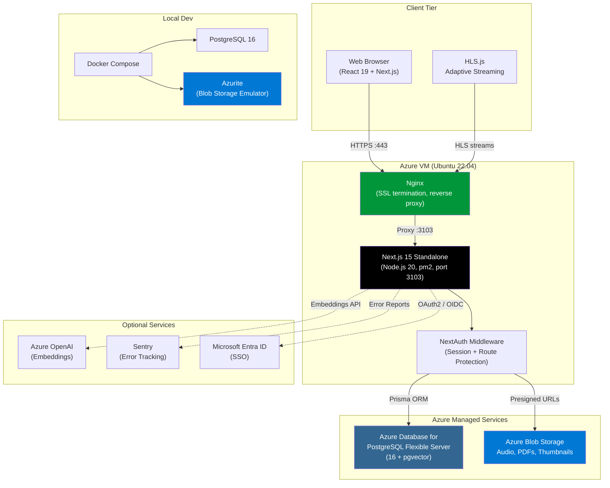

# The Audit Brief

Internal enterprise audio platform for managing, distributing, and tracking audit brief content across an organization.

## Table of Contents

- [Tech Stack](#tech-stack)
- [Architecture](#architecture)
- [Prerequisites](#prerequisites)
- [Local Development Setup](#local-development-setup)
- [Environment Variables](#environment-variables)
- [Authentication & SSO](#authentication--sso)
- [User Roles](#user-roles)
- [Testing](#testing)
- [Project Structure](#project-structure)
- [Deployment](#deployment)
- [Contributing](#contributing)

## Tech Stack

| Layer         | Technology                                | Purpose                                               |
| ------------- | ----------------------------------------- | ----------------------------------------------------- |
| Framework     | Next.js 15 (App Router), TypeScript 5     | Full-stack React framework with SSR/SSG               |
| Styling       | Tailwind CSS 4, shadcn/ui (Radix)         | Utility-first CSS with accessible component library   |
| State         | Zustand                                   | Client-side state (audio player, graph editor)        |
| Forms         | React Hook Form + Zod                     | Form state management and validation                  |
| Charts        | Recharts                                  | Analytics dashboard visualizations                    |
| Graph Editor  | @xyflow/react, Dagre                      | Visual learning path editor with auto-layout          |
| Drag & Drop   | @dnd-kit                                  | Sortable lists (audit brief ordering, linear editor)  |
| PDF Viewer    | react-pdf (pdfjs-dist)                    | In-app attachment/document viewing                    |
| Audio         | HLS.js                                    | Adaptive audio streaming with native fallback         |
| Database      | PostgreSQL 16, Prisma ORM (v6)            | Data persistence, migrations, pgvector search         |
| Auth          | NextAuth v4 (Credentials + Azure AD)      | JWT session strategy, HttpOnly cookies, SSO support   |
| Storage       | Azurite (dev) / Azure Blob Storage (prod) | File uploads (audio, images, PDFs) via Azure Blob API |
| Logging       | Pino                                      | Structured JSON logging with child loggers            |
| Validation    | Zod v4                                    | Request body + form validation (shared schemas)       |
| Security      | CSP, HSTS, CORS, next.config headers      | HTTP security headers, XSS/clickjack prevention       |
| Notifications | Sonner                                    | Toast notifications                                   |
| Icons         | Lucide React                              | Consistent icon set                                   |
| Theming       | next-themes                               | Dark/light mode switching                             |
| Testing       | Vitest, RTL, Playwright, MSW              | Unit, component, E2E tests (706 tests)                |
| Linting       | ESLint 9 (flat config), Prettier          | Code quality and formatting                           |
| Git Hooks     | Husky + lint-staged                       | Pre-commit lint/format enforcement                    |
| Monitoring    | Sentry                                    | Error tracking and performance monitoring             |
| CI/CD         | GitHub Actions                            | Automated lint, test, build, deploy pipelines         |
| Deployment    | Azure VM, Nginx, pm2                      | VM-based production deployment on port 3103           |

## Architecture



For detailed architecture diagrams covering frontend components, backend API routes, database schema (ER diagram), end-to-end product flow, and deployment infrastructure, see [docs/architecture-diagrams.md](docs/architecture-diagrams.md).

## Prerequisites

- **Node.js** >= 20
- **npm** >= 10
- **Docker** and **Docker Compose** (for PostgreSQL and Azurite)

## Local Development Setup

```bash
# 1. Clone the repository
git clone <repo-url> && cd the-audit-brief

# 2. Install dependencies
npm install

# 3. Copy environment file and adjust values
cp .env.example .env

# 4. Start infrastructure (PostgreSQL + Azurite)
docker compose up -d

# 5. Run database migrations
npx prisma migrate dev

# 6. Seed the database (if applicable)
npx prisma db seed

# 7. Start the development server
npm run dev
```

The app will be available at [http://localhost:3000](http://localhost:3000).

## Environment Variables

| Variable                       | Description                          | Default / Required        |
| ------------------------------ | ------------------------------------ | ------------------------- |
| `DATABASE_URL`                 | PostgreSQL connection string         | (required)                |
| `NEXTAUTH_SECRET`              | NextAuth JWT encryption secret       | (required, min 32 chars)  |
| `NEXTAUTH_URL`                 | Canonical app URL                    | `http://localhost:3000`   |
| `PORT`                         | Server listen port                   | `3000` (prod: `3103`)     |
| `AZURE_BLOB_CONNECTION_STRING` | Azure Blob Storage connection string | (required)                |
| `AZURE_BLOB_CONTAINER`         | Azure Blob container name            | `the-audit-brief-uploads` |
| `AZURE_AD_CLIENT_ID`           | Microsoft Entra ID app client ID     | (optional, for SSO)       |
| `AZURE_AD_CLIENT_SECRET`       | Microsoft Entra ID app client secret | (optional, for SSO)       |
| `AZURE_AD_TENANT_ID`           | Microsoft Entra ID tenant ID         | (optional, for SSO)       |
| `AZURE_OPENAI_ENDPOINT`        | Azure OpenAI service endpoint        | (optional)                |
| `AZURE_OPENAI_KEY`             | Azure OpenAI API key                 | (optional)                |
| `AZURE_OPENAI_DEPLOYMENT`      | Azure OpenAI deployment name         | (optional)                |
| `SENTRY_DSN`                   | Sentry error tracking DSN (server)   | (optional)                |
| `NEXT_PUBLIC_SENTRY_DSN`       | Sentry DSN (client bundle)           | (optional)                |
| `NEXT_PUBLIC_APP_URL`          | Public application URL               | `http://localhost:3000`   |
| `NODE_ENV`                     | Runtime environment                  | `development`             |
| `LOG_LEVEL`                    | Pino log level                       | `debug`                   |

## Authentication & SSO

The app uses **NextAuth v4** with two authentication providers:

- **Credentials** — email/password login with bcrypt verification
- **Azure AD** — Microsoft Entra ID SSO via OAuth2/OIDC

### How SSO Works

1. User clicks **"Sign in with Microsoft"** on the login page.
2. NextAuth redirects to Microsoft Entra ID for authentication.
3. After successful login, Entra ID redirects back to `/api/auth/callback/azure-ad`.
4. The `signIn` callback handles account linking:
   - If a user with that email already exists in the database, the Azure AD account is **linked** to the existing user record.
   - The `authProvider` field is set to `"entra_id"` (SSO-only) or `"both"` (if they also have a password).
   - If no existing user is found, a new user record is created automatically.
5. The `jwt` callback injects `userId` and `role` from the database into the session token.
6. The middleware enforces route-level auth and admin role checks on every request.

### Azure AD Setup

To enable SSO, register an application in Microsoft Entra ID:

1. Go to **Azure Portal > Entra ID > App Registrations > New Registration**.
2. Set the **Redirect URI**:
   - **Platform:** Select **"Web"** (NOT "Single-page application")
   - **URL:** `https://your-domain.com/api/auth/callback/azure-ad` (use `http://localhost:3000/api/auth/callback/azure-ad` for local dev)
3. Under **Certificates & Secrets**, create a new client secret.

> **Warning:** This is a server-rendered application using a confidential OAuth client.
> The Entra ID app registration platform MUST be "Web", not "SPA". 4. Set the following environment variables:

```bash
AZURE_AD_CLIENT_ID=<Application (client) ID>
AZURE_AD_CLIENT_SECRET=<Client secret value>
AZURE_AD_TENANT_ID=<Directory (tenant) ID>
```

To restrict which users can sign in, go to **Enterprise Applications > your app > Properties** and set **"Assignment required?"** to **Yes**, then assign specific users or groups.

## User Roles

Roles are managed locally in the database (not pulled from Azure AD). Each user has a `role` column that defaults to `"public"`.

| Role         | Access Level                                                     |
| ------------ | ---------------------------------------------------------------- |
| `public`     | Standard user — view content, bookmark, track listening progress |
| `admin`      | Access `/admin` routes — upload, edit, and manage audit briefs   |
| `superadmin` | Full admin access plus user role management                      |

The middleware redirects non-admin users to `/unauthorized` when they attempt to access `/admin/*` routes. API routes use `requireRole()` to enforce role checks.

### Assigning Roles

When a user first signs in (via SSO or credentials), they receive the default `"public"` role. To grant elevated access, update their role directly in the database:

```sql
UPDATE users SET role = 'admin' WHERE email = 'user@yourorg.com';
```

Alternatively, a `superadmin` can change user roles from the admin UI at `/admin/users`.

## Testing

```bash
# Run all unit and integration tests
npm test

# Run tests in watch mode
npm run test:watch

# Run tests with coverage report
npm run test:coverage

# Run end-to-end tests
npm run test:e2e

# Run e2e tests with interactive UI
npm run test:e2e:ui
```

A `.env.test` file is provided for CI test environments.

## Project Structure

```
the-audit-brief/
├── app/
│   ├── (admin)/          # Admin dashboard routes
│   ├── (auth)/           # Login and authentication pages
│   ├── (public)/         # Public-facing routes
│   └── api/              # API route handlers
│       ├── admin/        # Admin management endpoints
│       ├── auth/         # Authentication endpoints
│       ├── bookmarks/    # Bookmark endpoints
│       ├── health/       # Health check
│       ├── learning-graphs/
│       ├── audit-briefs/ # Audit Brief CRUD
│       ├── progress/     # Listening progress
│       ├── search/       # Search endpoints
│       ├── upload/       # File upload
│       └── users/        # User management
├── components/           # React UI components
├── hooks/                # Custom React hooks
├── lib/                  # Shared utilities and services
│   ├── api/              # API helpers (errors, pagination, rate limiting, CORS)
│   ├── auth/             # JWT and authentication logic
│   ├── schemas/          # Zod validation schemas
│   └── ...               # DB client, logger, storage, etc.
├── stores/               # Zustand state stores
├── prisma/               # Prisma schema and migrations
├── __tests__/            # Test suites
│   ├── unit/             # Unit tests
│   ├── integration/      # Integration tests
│   └── e2e/              # Playwright end-to-end tests
├── Dockerfile            # Production container image
├── docker-compose.yml    # Local development infrastructure
└── middleware.ts          # Next.js edge middleware (auth)
```

## Deployment

**Target platform:** Azure VM (Ubuntu 22.04 LTS) with Nginx reverse proxy and pm2 process manager.

The application runs as a standalone Next.js server on **port 3103**, managed by pm2 for automatic restarts and clustering. Nginx handles SSL termination and proxies traffic from ports 80/443 to the app.

**Infrastructure:**

- **Compute:** Azure VM (Standard_B2s or larger)
- **Database:** Azure Database for PostgreSQL Flexible Server (with pgvector)
- **Storage:** Azure Blob Storage
- **Process Manager:** pm2
- **Reverse Proxy:** Nginx with Let's Encrypt SSL

```bash
# On the Azure VM:
npm install && npm run build
pm2 start ecosystem.config.js
```

For the complete step-by-step deployment guide, see [docs/deployment-guide.md](docs/deployment-guide.md).

## Contributing

### Branch Naming

```
feat/short-description
fix/short-description
chore/short-description
```

### Commit Messages

Follow [Conventional Commits](https://www.conventionalcommits.org/):

```
feat: add audit brief search endpoint
fix: correct token expiry calculation
chore: update dependencies
```

### Pull Request Process

1. Create a feature branch from `main`.
2. Make changes and ensure all tests pass (`npm test`).
3. Run linting and formatting checks (`npm run lint && npm run format:check`).
4. Run type checking (`npm run typecheck`).
5. Open a pull request with a clear description of changes.
6. Obtain at least one approval before merging.
