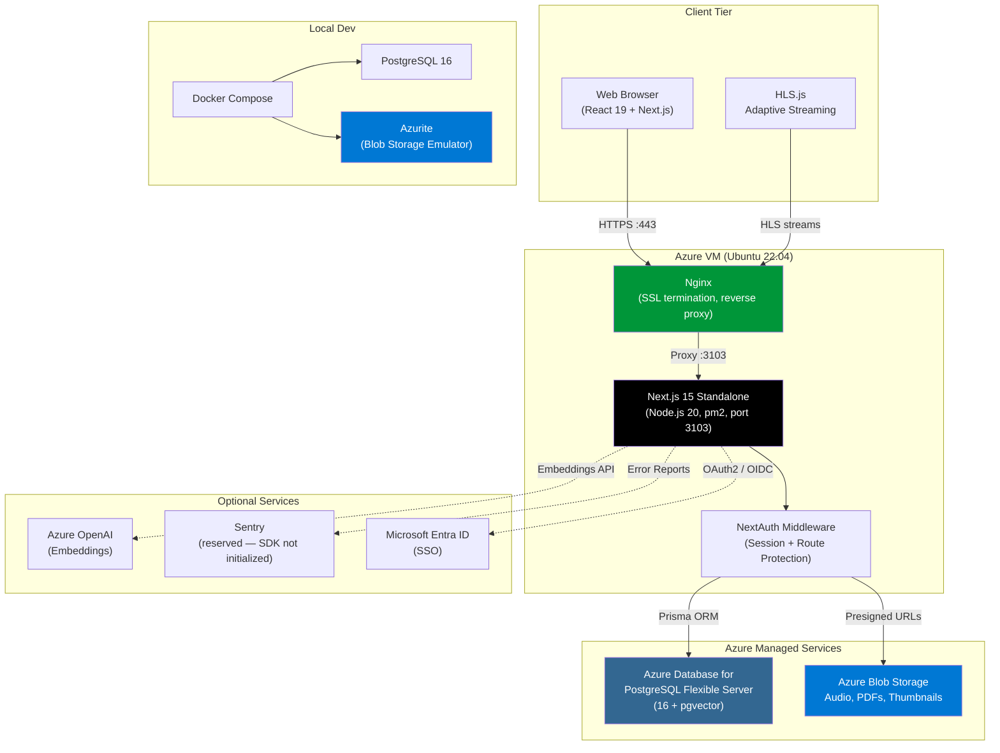

# The Audit Brief

Internal enterprise audio platform for managing, distributing, and tracking audit brief content across an organization.

## Table of Contents

- [Tech Stack](#tech-stack)
- [Architecture](#architecture)
- [Prerequisites](#prerequisites)
- [Local Development Setup](#local-development-setup)
- [Environment Variables](#environment-variables)
- [Authentication & SSO](#authentication--sso)
- [User Roles](#user-roles)
- [Testing](#testing)
- [API Reference](#api-reference)
- [Project Structure](#project-structure)
- [Observability](#observability)
- [Deployment](#deployment)
- [Content Security Policy](#content-security-policy)
- [Contributing](#contributing)
- [Changelog](#changelog)

## Tech Stack

| Layer         | Technology                                | Purpose                                                          |
| ------------- | ----------------------------------------- | ---------------------------------------------------------------- |
| Framework     | Next.js 15.3 (App Router), TypeScript 5   | Full-stack React framework with SSR + basePath deployment        |
| Styling       | Tailwind CSS 4, shadcn/ui (Radix)         | Utility-first CSS with accessible component library              |
| State         | Zustand 5                                 | Client-side state (`player-store`, `graph-editor-store`)         |
| Forms         | React Hook Form + Zod 4                   | Form state management and validation                             |
| Charts        | Recharts                                  | Admin analytics dashboard visualizations                         |
| Sortable      | @dnd-kit/core + @dnd-kit/sortable         | Linear learning-path editor (drag-to-reorder episodes)           |
| PDF Viewer    | react-pdf                                 | In-app bulletin/attachment viewing (pdfjs bundled transitively)  |
| Audio         | HLS.js + HTML5 `<audio>`                  | Adaptive streaming with native fallback and HTTP-Range proxy     |
| Database      | PostgreSQL 16 (pgvector), Prisma ORM 6    | Data persistence, migrations, semantic-search vectors            |
| Auth          | NextAuth v4 (Credentials + Azure AD)      | JWT session cookie strategy, HttpOnly cookies, SSO support       |
| Storage       | Azurite (dev) / Azure Blob Storage (prod) | Audio, PDFs, thumbnails — private container, SAS-signed access   |
| Logging       | Pino                                      | Structured JSON logging with child loggers + request IDs         |
| Validation    | Zod 4                                     | Request body + form validation (shared schemas)                  |
| Security      | Per-request nonce CSP, HSTS, CORS         | XSS/clickjack prevention; see Content Security Policy section    |
| Notifications | Sonner                                    | Toast notifications                                              |
| Icons         | Lucide React                              | Consistent icon set                                              |
| Theming       | next-themes                               | Dark/light mode switching (nonce-aware FOUC script)              |
| Testing       | Vitest 4, RTL, Playwright, MSW            | ~90 test files / 850+ test cases across unit / integration / E2E |
| Linting       | ESLint 9 (flat config), Prettier          | Code quality and formatting                                      |
| Git Hooks     | Husky v9 + lint-staged                    | Pre-commit lint/format enforcement                               |
| Monitoring    | Pino + pm2 logs                           | Sentry env vars reserved but **SDK not currently initialized**   |
| CI/CD         | GitHub Actions                            | Automated lint, test, build (deploy currently runs on the VM)    |
| Deployment    | Azure VM, Nginx, pm2                      | VM-based production deployment on port 3103                      |

## Architecture



For detailed architecture diagrams covering frontend components, backend API routes, database schema (ER diagram), end-to-end product flow, and deployment infrastructure, see [docs/architecture-diagrams.md](docs/architecture-diagrams.md).

## Prerequisites

- **Node.js** >= 20
- **npm** >= 10
- **Docker** and **Docker Compose** (for PostgreSQL and Azurite)

## Local Development Setup

```bash
# 1. Clone the repository
git clone <repo-url> && cd the-audit-brief

# 2. Install dependencies
npm install

# 3. Copy environment file and adjust values
cp .env.example .env

# 4. Start infrastructure (PostgreSQL + Azurite)
docker compose up -d

# 5. Run database migrations
npx prisma migrate dev

# 6. Seed the database (if applicable)
npx prisma db seed

# 7. Start the development server
npm run dev
```

The app will be available at [http://localhost:3000/auditbrief](http://localhost:3000/auditbrief).

> **Note:** The app is configured with `basePath: '/auditbrief'` in `next.config.ts`, so all routes are prefixed with `/auditbrief`. This matches the subpath deployment on the shared Azure VM (e.g., `uat.uno.wcgt.in/auditbrief`).

## Environment Variables

| Variable                            | Description                                                             | Default / Required                 |
| ----------------------------------- | ----------------------------------------------------------------------- | ---------------------------------- |
| `DATABASE_URL`                      | PostgreSQL connection string                                            | (required)                         |
| `NEXTAUTH_SECRET`                   | NextAuth JWT encryption secret                                          | (required, min 32 chars)           |
| `NEXTAUTH_URL`                      | Canonical app URL (must include `/auditbrief` basePath)                 | `http://localhost:3000/auditbrief` |
| `PORT`                              | Server listen port                                                      | `3000` (prod: `3103`)              |
| `AZURE_BLOB_CONNECTION_STRING`      | Azure Blob Storage connection string                                    | (required)                         |
| `AZURE_BLOB_CONTAINER`              | Azure Blob container name                                               | `the-audit-brief-uploads`          |
| `AZURE_AD_CLIENT_ID`                | Microsoft Entra ID app client ID                                        | (optional, for SSO)                |
| `AZURE_AD_CLIENT_SECRET`            | Microsoft Entra ID app client secret                                    | (optional, for SSO)                |
| `AZURE_AD_TENANT_ID`                | Microsoft Entra ID tenant ID                                            | (optional, for SSO)                |
| `AZURE_OPENAI_ENDPOINT`             | Azure OpenAI service endpoint                                           | (optional)                         |
| `AZURE_OPENAI_API_KEY`              | Azure OpenAI API key (read by `lib/embeddings.ts:33`)                   | (optional)                         |
| `AZURE_OPENAI_EMBEDDING_DEPLOYMENT` | Azure OpenAI embedding deployment name (read by `lib/embeddings.ts:34`) | (optional)                         |
| `SENTRY_DSN`                        | Sentry error tracking DSN — **reserved; SDK not currently initialized** | (reserved)                         |
| `NEXT_PUBLIC_SENTRY_DSN`            | Sentry DSN (client bundle) — **reserved**                               | (reserved)                         |
| `NEXT_PUBLIC_APP_URL`               | Origin URL for CORS (no basePath)                                       | `http://localhost:3000`            |
| `NEXT_PUBLIC_BASE_PATH`             | Deployment subpath (must match basePath of `NEXTAUTH_URL`)              | `/auditbrief`                      |
| `BCRYPT_SALT_ROUNDS`                | Bcrypt cost factor for password hashing (`lib/auth/password.ts`)        | `12`                               |
| `SLOW_QUERY_THRESHOLD_MS`           | Slow-query log threshold in ms (`lib/db-instrumentation.ts:26`)         | `500`                              |
| `NODE_ENV`                          | Runtime environment                                                     | `development`                      |
| `LOG_LEVEL`                         | Pino log level                                                          | `debug`                            |

> **Legacy variable names:** Infrastructure templates may still emit `AZURE_OPENAI_KEY` / `AZURE_OPENAI_DEPLOYMENT`. Application code reads only the new `_API_KEY` / `_EMBEDDING_DEPLOYMENT` names; populate the new ones in `.env`.

## Authentication & SSO

The app uses **NextAuth v4** with two authentication providers:

- **Credentials** — email/password login with bcrypt verification
- **Azure AD** — Microsoft Entra ID SSO via OAuth2/OIDC

### How SSO Works

1. User clicks **"Sign in with Microsoft"** on the login page.
2. NextAuth redirects to Microsoft Entra ID for authentication.
3. After successful login, Entra ID redirects back to `/api/auth/callback/azure-ad`.
4. The `signIn` callback handles account linking:
   - If a user with that email already exists in the database, the Azure AD account is **linked** to the existing user record.
   - The `authProvider` field is set to `"entra_id"` (SSO-only) or `"both"` (if they also have a password).
   - If no existing user is found, a new user record is created automatically.
5. The `jwt` callback injects `userId` and `role` from the database into the session token.
6. The middleware enforces route-level auth and admin role checks on every request.

### Azure AD Setup

To enable SSO, register an application in Microsoft Entra ID:

1. Go to **Azure Portal > Entra ID > App Registrations > New Registration**.
2. Set the **Redirect URI**:
   - **Platform:** Select **"Web"** (NOT "Single-page application")
   - **URL:** `https://your-domain.com/auditbrief/api/auth/callback/azure-ad` (use `http://localhost:3000/auditbrief/api/auth/callback/azure-ad` for local dev)
3. Under **Certificates & Secrets**, create a new client secret.

> **Warning:** This is a server-rendered application using a confidential OAuth client.
> The Entra ID app registration platform MUST be "Web", not "SPA". 4. Set the following environment variables:

```bash
AZURE_AD_CLIENT_ID=<Application (client) ID>
AZURE_AD_CLIENT_SECRET=<Client secret value>
AZURE_AD_TENANT_ID=<Directory (tenant) ID>
```

To restrict which users can sign in, go to **Enterprise Applications > your app > Properties** and set **"Assignment required?"** to **Yes**, then assign specific users or groups.

## User Roles

Roles are managed locally in the database (not pulled from Azure AD). Each user has a `role` column that defaults to `"public"`.

| Role         | Access Level                                                     |
| ------------ | ---------------------------------------------------------------- |
| `public`     | Standard user — view content, bookmark, track listening progress |
| `admin`      | Access `/admin` routes — upload, edit, and manage audit briefs   |
| `superadmin` | Full admin access plus user role management                      |

The middleware redirects non-admin users to `/unauthorized` when they attempt to access `/admin/*` routes. API routes use `requireRole()` to enforce role checks.

### Assigning Roles

When a user first signs in (via SSO or credentials), they receive the default `"public"` role. To grant elevated access, update their role directly in the database:

```sql
UPDATE users SET role = 'admin' WHERE email = 'user@yourorg.com';
```

Alternatively, a `superadmin` can change user roles from the admin UI at `/admin/users`.

## Testing

```bash
# Run all unit and integration tests (Vitest, jsdom)
npm test
npm run test:watch          # Watch mode
npm run test:coverage       # v8 coverage report (lines 45 %, branches 40 %, fns 35 %)

# End-to-end tests (Playwright, Chromium)
npm run test:e2e
npm run test:e2e:ui         # Interactive Playwright UI

# Quality gates
npm run typecheck           # tsc --noEmit (strict mode)
npm run lint                # ESLint 9 flat config
npm run lint:fix
npm run format:check        # Prettier (verify)
npm run format              # Prettier (write)
```

- Test setup lives in [vitest.setup.ts](vitest.setup.ts) (mocks `server-only`, `window.matchMedia`).
- CSP-specific E2E tests use the separate [playwright.csp.config.ts](playwright.csp.config.ts) suite.
- A `.env.test` file is provided for CI test environments (test DB URL, dummy auth secrets, suppressed log level).
- MSW (`msw@2`) is installed for API mocking; handlers are typically inline per test.

## API Reference

25 endpoints under `app/api/`. Source-of-truth specs: [`docs/openapi.yaml`](docs/openapi.yaml) (regenerate from JSON via `node scripts/regenerate-openapi-yaml.mjs`). For an auditable URL-by-URL index with file:line citations, see [`application-links.md`](application-links.md) §5.

| Group       | Endpoints                                                                                                                                               |
| ----------- | ------------------------------------------------------------------------------------------------------------------------------------------------------- |
| **Health**  | `GET /api/health` (liveness), `GET /api/ready` (readiness + DB ping)                                                                                    |
| **Auth**    | `GET\|POST /api/auth/[...nextauth]`, `POST /api/auth/register`                                                                                          |
| **Content** | `audit-briefs` (CRUD + `/transcript` + `/batch`), `learning-graphs` (CRUD + `/data` bulk save)                                                          |
| **Search**  | `GET /api/search` (keyword), `POST /api/search` (semantic — pgvector + Azure OpenAI embeddings)                                                         |
| **Media**   | `GET /api/media?key=` (streaming proxy with HTTP Range support, no in-memory buffering)                                                                 |
| **User**    | `bookmarks` (CRUD), `favorites` (toggle), `learning-graph-favorites` (toggle), `progress` (GET/POST/PUT), `activity` (fire-and-forget activity logging) |
| **Upload**  | `POST /api/upload` (presigned SAS URL), `POST /api/upload/file` (multipart, excluded from edge middleware due to body cap)                              |
| **Admin**   | `users` + `users/[id]/role` (superadmin), `admin/analytics`, `admin/blob-sweep` (orphan blob cleanup, superadmin, dry-run by default)                   |

A rendered Swagger UI for VAPT consumers is at [`openapi-auditbrief.html`](openapi-auditbrief.html).

## Project Structure

```text
the-audit-brief/
├── app/
│   ├── (auth)/                       # login, register, unauthorized
│   ├── (public)/                     # /, bulletins, audit-brief/[id], search,
│   │                                 #   learning-path[/[id]], progress
│   ├── (admin)/                      # /admin, upload, edit/[id][/transcript],
│   │                                 #   learning-graphs[/new|/[id]], users,
│   │                                 #   analytics, audit-log
│   └── api/                          # 25 endpoints (see "API Reference")
│       ├── activity/                 # Fire-and-forget user activity log
│       ├── admin/
│       │   ├── analytics/            # Admin analytics aggregations
│       │   └── blob-sweep/           # Orphan blob cleanup (superadmin)
│       ├── audit-briefs/             # CRUD + transcript + batch
│       ├── auth/                     # NextAuth + register
│       ├── bookmarks/                # User bookmark CRUD
│       ├── favorites/                # AuditBrief favorite toggle
│       ├── health/                   # Liveness probe
│       ├── learning-graph-favorites/ # LearningGraph favorite toggle
│       ├── learning-graphs/          # CRUD + bulk graph save
│       ├── media/                    # Streaming Azure Blob proxy (HTTP Range)
│       ├── progress/                 # Per-user episode completion
│       ├── ready/                    # Readiness probe (DB ping)
│       ├── search/                   # Keyword + semantic search
│       ├── upload/                   # Presigned SAS + multipart file
│       └── users/                    # User CRUD + role assignment
├── components/
│   ├── ui/                           # shadcn primitives (Radix wrappers)
│   ├── audio-player/                 # Global player, transcript, bulletin viewer
│   ├── admin/                        # Upload wizard, tables, transcript editor
│   ├── learning-path/                # Linear editor, episode sidebar, path viewer
│   ├── layout/                       # Sidebar, mobile bars, command palette
│   ├── auth/                         # Login/register forms, SSO button
│   ├── search/, progress/, home/,    # Feature-scoped UI
│   │   library/
│   └── providers/                    # Session, Theme, Nonce, Audio providers
├── hooks/                            # 13 custom React hooks
├── lib/
│   ├── db.ts                         # Prisma client singleton
│   ├── db-instrumentation.ts         # Slow-query Pino logging
│   ├── api/                          # errors, pagination, rate-limit, cors,
│   │                                 #   request-context, request-logging
│   ├── auth/                         # NextAuth config, password, token revocation,
│   │                                 #   Prisma adapter, env validation
│   ├── admin/                        # audit-log, blob-sweep, concurrency, revalidate
│   ├── security/                     # csp.ts (nonce + policy)
│   ├── config/                       # base-path.ts (`withBasePath()`)
│   ├── schemas/                      # Zod entity schemas
│   ├── storage.ts + storage-*.ts     # Azure Blob ops + support family
│   ├── embeddings.ts                 # Azure OpenAI embeddings (retry + backoff)
│   ├── upload.ts                     # File-type / size validation
│   ├── logger.ts                     # Pino logger
│   └── file-to-data-url.ts,          # Misc utilities
│       attachment-utils.ts,
│       domain-colors.ts,
│       navigation-config.ts,
│       format-time.ts, utils.ts
├── stores/                           # player-store, graph-editor-store, helpers
├── prisma/                           # schema.prisma (14 models), migrations/, seed.ts
├── scripts/                          # bootstrap-azure.sh, migrate-production.sh,
│                                     #   backfill-transcript-embeddings.ts,
│                                     #   regenerate-openapi-yaml.mjs
├── __tests__/
│   ├── unit/                         # Pure / function unit tests
│   ├── integration/                  # API + component integration tests (RTL + MSW)
│   └── e2e/                          # Playwright (Chromium)
├── docs/
│   ├── deployment-guide.md           # Canonical VM + Nginx + pm2 deployment
│   ├── architecture-diagrams.md      # Top-level system mermaid diagrams
│   ├── architecture/                 # C4 .mmd source diagrams
│   ├── csp-nonce-nginx-integration-guide.md
│   ├── openapi.{json,yaml}           # OpenAPI 3 spec
│   ├── PRD_PODCAST_HUB_V2.md         # Historical product spec
│   └── superpowers/{plans,specs}/    # Historical planning artefacts
├── application-links.md              # Exhaustive URL / route / env index
├── openapi-auditbrief.html           # Rendered Swagger UI
├── Dockerfile                        # Multi-stage build (deps → builder → runner)
├── docker-compose.yml                # Local dev: PostgreSQL + Azurite
├── middleware.ts                     # Auth + CSP nonce + request-id propagation
├── next.config.ts                    # basePath, standalone output, security headers
├── vitest.config.ts                  # Vitest + jsdom + coverage thresholds
├── playwright.config.ts              # Playwright (Chromium)
└── playwright.csp.config.ts          # CSP-specific E2E suite
```

## Observability

- **Structured logging via Pino.** Every API route is wrapped in `lib/api/request-logging-middleware.ts`, which emits a JSON log per request with `request_id`, `method`, `path`, `status`, `duration_ms`, and (when authenticated) `user_id` + `user_role`. Use `lib/logger.ts` to obtain child loggers; never call `console.log` in production code.
- **Request correlation.** The middleware (`middleware.ts`) generates an `x-request-id` for every request and propagates it as a response header. The same ID is attached to all Pino logs in the request scope via `lib/api/request-context.ts`.
- **Slow-query logging.** `lib/db-instrumentation.ts` wraps Prisma with a middleware that emits a `warn`-level log whenever a query exceeds `SLOW_QUERY_THRESHOLD_MS` (default `500`).
- **Health probes.** `GET /api/health` is a lightweight liveness check (always 200 if the process is up). `GET /api/ready` performs a `SELECT 1` against the database and returns 503 if it fails — wire this to Nginx / your load balancer for traffic gating.
- **Admin audit log.** Mutating admin operations write to the `AdminAuditLog` table via `lib/admin/audit-log.ts` with before/after JSON snapshots. View at `/admin/audit-log`.
- **Sentry.** Env vars (`SENTRY_DSN`, `NEXT_PUBLIC_SENTRY_DSN`) are reserved in `.env.example` but the Sentry SDK is **not currently initialized** — there is no `sentry.client.config.ts` / `sentry.server.config.ts` / `instrumentation.ts`. Add these files in a separate PR if you want error tracking.

## Deployment

**Target platform:** Azure VM (Ubuntu 22.04 LTS) with Nginx reverse proxy and pm2 process manager.

The application runs as a standalone Next.js server on **port 3103**, managed by pm2 for automatic restarts and clustering. Nginx handles SSL termination and proxies traffic from ports 80/443 to the app.

### Subpath Deployment

The app is configured with `basePath: '/auditbrief'` so it can be served alongside other apps on a shared VM under `uat.uno.wcgt.in/auditbrief`. Nginx routes `/auditbrief/*` to port 3103.

Key env vars for the VM `.env`:

```bash
NEXTAUTH_URL=https://uat.uno.wcgt.in/auditbrief    # Must include basePath
NEXT_PUBLIC_APP_URL=https://uat.uno.wcgt.in          # Origin only, no basePath (used for CORS)
```

The Azure AD redirect URI in Entra ID must also include the basePath:
`https://uat.uno.wcgt.in/auditbrief/api/auth/callback/azure-ad`

**Infrastructure:**

- **Compute:** Azure VM (Standard_B2s or larger)
- **Database:** Azure Database for PostgreSQL Flexible Server (with pgvector)
- **Storage:** Azure Blob Storage
- **Process Manager:** pm2
- **Reverse Proxy:** Nginx with Let's Encrypt SSL

```bash
# On the Azure VM:
cp .env.example .env   # Single .env file — fill in production values
npm install && npm run build
npx prisma migrate deploy   # Apply pending migrations (not 'migrate dev')
pm2 start ecosystem.config.js
```

> **`ecosystem.config.js` is not committed to the repository** — its log paths and `env_file` paths are VM-specific. Create it on the VM following [docs/deployment-guide.md §8.2](docs/deployment-guide.md#82-create-pm2-ecosystem-config).
>
> **`.github/workflows/cd.yml` is currently out of sync** with production. It targets Azure Container Apps via ACR and federated OIDC, which is not the active deployment path. Do not enable it on `push` triggers without first updating image build, migrations strategy, env vars, and post-deploy health checks. The canonical path is the VM procedure described here and in [docs/deployment-guide.md](docs/deployment-guide.md).

For the complete step-by-step deployment guide, see [docs/deployment-guide.md](docs/deployment-guide.md).

### Required Nginx Configuration

> **Other apps on the same VM (uno, xray, etc.) that want to adopt this nonce-based CSP pattern:** read [docs/csp-nonce-nginx-integration-guide.md](docs/csp-nonce-nginx-integration-guide.md). It is the standalone playbook covering symptoms, root cause, exact app-side code, the nginx snippet, verification, and an FAQ — written for engineers from other teams who have never seen this codebase.

The `/auditbrief` app generates its own per-request, nonce-based `Content-Security-Policy` header in middleware (see [Content Security Policy](#content-security-policy) below). The nginx server block on the shared VM has a different, strict server-wide CSP that applies to the other apps. We need nginx to stop adding that server-wide CSP **only** for `/auditbrief`, so the app's nonce-based CSP reaches the browser unchanged. Every other app keeps the existing CSP.

#### What to change

Inside **both** `/auditbrief` location blocks (`location = /auditbrief` and `location ^~ /auditbrief/`), add the following lines just after the existing `proxy_set_header` lines:

```nginx
# Re-add server-wide security headers EXCEPT Content-Security-Policy.
# The /auditbrief app sets its own per-request CSP with a nonce.
# Do NOT add Content-Security-Policy here, and do NOT use
# `proxy_hide_header Content-Security-Policy;` — both break the nonce.
add_header Strict-Transport-Security "max-age=31536000; includeSubDomains; preload" always;
add_header X-Frame-Options            "SAMEORIGIN" always;
add_header Referrer-Policy            "strict-origin-when-cross-origin" always;
add_header X-Content-Type-Options     "nosniff" always;
add_header Cache-Control              "no-store, no-cache, must-revalidate, proxy-revalidate" always;
add_header Pragma                     "no-cache" always;
add_header Expires                    "0" always;
```

#### Why these seven lines

Nginx rule: any `add_header` inside a `location` block cancels **all** `add_header` inheritance from the surrounding `server` block. Re-listing every header we want (and omitting `Content-Security-Policy`) is how we tell nginx "everything except CSP" for `/auditbrief` without touching the rest of the file.

This is **not** a relaxation of the security policy. The app emits a strict policy that:

- forbids inline scripts and styles by default,
- only permits the framework's own RSC/hydration scripts via a per-request, cryptographically-random `nonce`,
- adds `'strict-dynamic'` so chunk loaders work without an explicit allowlist,
- keeps `default-src`, `connect-src`, `img-src`, `font-src`, `worker-src`, `frame-ancestors` at least as strict as the nginx server-wide policy.

#### Apply

```bash
sudo nginx -t
sudo systemctl reload nginx
```

#### Validate from a workstation

```bash
# Exactly ONE Content-Security-Policy header, containing nonce-... and strict-dynamic.
curl -sI https://uat.uno.wcgt.in/auditbrief/login | grep -i 'content-security-policy'

# Two consecutive requests must return DIFFERENT nonce values.
curl -sI https://uat.uno.wcgt.in/auditbrief/login | grep -oE 'nonce-[A-Za-z0-9+/=]+' | head -1
curl -sI https://uat.uno.wcgt.in/auditbrief/login | grep -oE 'nonce-[A-Za-z0-9+/=]+' | head -1

# Other apps still get the original strict CSP — confirms only /auditbrief was changed.
curl -sI https://uat.uno.wcgt.in/ | grep -i 'content-security-policy'
```

If you see two CSP headers, or one without `nonce-...`, the change has not taken effect — re-check the edits and run `sudo nginx -t && sudo systemctl reload nginx` again.

## Content Security Policy

The app runs under a strict, nonce-based CSP. This section documents the architecture so future contributors do not unknowingly add inline content that the policy will block.

### How it works

1. [middleware.ts](middleware.ts) runs on every HTML/API request. It generates a random nonce per request via [lib/security/csp.ts](lib/security/csp.ts) (`generateNonce()`).
2. The nonce is propagated to the render pipeline via the `x-nonce` request header. Next.js's App Router automatically stamps that nonce onto every framework-emitted `<script>` tag (the inline RSC payload chunks `self.__next_f.push(...)`, the hydration bootstrap, Suspense flush boundaries) and `<link rel="stylesheet">` tag.
3. The same middleware sets the matching `Content-Security-Policy` response header. The policy assembled by `buildContentSecurityPolicy(nonce)` enforces:

   ```text
   default-src 'self';
   script-src 'self' 'nonce-<random>' 'strict-dynamic';
   style-src 'self' 'nonce-<random>';
   style-src-attr 'unsafe-inline';
   img-src 'self' data: blob:;
   media-src 'self' blob:;
   font-src 'self' data:;
   connect-src 'self';
   worker-src 'self' blob:;
   frame-ancestors 'self';
   base-uri 'self';
   form-action 'self';
   object-src 'none';
   upgrade-insecure-requests
   ```

4. [app/layout.tsx](app/layout.tsx) reads the nonce via `headers()` and:
   - emits `<meta name="csp-nonce" content="…">` so `motion/react` picks it up;
   - injects a small bootstrap `<script nonce="…">` at the top of `<body>` that monkey-patches `Document.prototype.createElement` so any `<style>` element a third-party library (sonner, motion, recharts, @dnd-kit) creates at runtime gets the nonce stamped on it before insertion;
   - passes `nonce={nonce}` to `<ThemeProvider>` so `next-themes` applies it to its FOUC-prevention inline script.

### `style-src-attr 'unsafe-inline'` — what it is and why it's safe

CSP nonces apply to `<style>` _tags_ only. Inline `style="…"` _attributes_ (React `style={{}}` props, motion transforms, dnd-kit drag previews, recharts tooltips, resizable-panels) cannot carry a nonce by spec. Allowing them via `style-src-attr 'unsafe-inline'` is **qualitatively very different** from `script-src 'unsafe-inline'`:

- `script-src 'unsafe-inline'` — catastrophic. Any reflected XSS becomes RCE.
- `style-src-attr 'unsafe-inline'` — low risk. An attacker who can already inject HTML can affect appearance but cannot execute code or exfiltrate data beyond very limited CSS-side-channel attacks. OWASP and the CSP3 spec explicitly model this split for exactly this reason.

### Rules for contributors

- **Do not add new inline `<style>{...}</style>` JSX nodes.** Move static CSS (e.g. `@keyframes`) to [app/globals.css](app/globals.css). React `style={{}}` props are fine — they're inline attributes covered by `style-src-attr`.
- **Do not introduce `dangerouslySetInnerHTML` for scripts.** The only such usage is the bootstrap nonce-patcher in `app/layout.tsx`, which is server-rendered with a known-safe nonce string.
- **Do not load scripts/styles/fonts/images from external CDNs.** Use the local package or vendor the asset under `public/` / `node_modules` (Next.js will bundle it). The PDF.js worker in [components/audio-player/bulletin-viewer.tsx](components/audio-player/bulletin-viewer.tsx) is a reference example: `new URL('pdfjs-dist/build/pdf.worker.min.mjs', import.meta.url).toString()`.
- **Do not call `eval`, `new Function`, or string-form `setTimeout`/`setInterval`.** `script-src` does not include `'unsafe-eval'`.
- **Do not hard-code Azure Blob, Sentry ingest, or other external hostnames into client code.** `connect-src 'self'` blocks them; proxy through `/api/...` instead (the `/api/media` proxy is the reference example).

### Adding a new third-party UI library

If a new library injects styles or scripts at runtime, the bootstrap nonce-patcher in `app/layout.tsx` will catch any `<style>` it creates via `document.createElement('style')` (which is the common pattern). Verify by running `npm run build && node .next/standalone/server.js`, opening the app in Chrome with DevTools Console, and exercising the library's UI. Any `Refused to apply inline style` / `Refused to execute inline script` message is a regression.

If a library uses a different injection mechanism (e.g. `innerHTML`, `insertAdjacentHTML`, or a dedicated CSSOM API like `CSSStyleSheet.replaceSync`), and it does not accept a `nonce` prop, prefer:

1. importing the library's static CSS file in `app/layout.tsx` (`import 'pkg/dist/styles.css'`) so Next.js bundles it into a same-origin stylesheet — no nonce needed; or
2. replacing the library with a nonce-aware alternative.

## Contributing

See [CONTRIBUTING.md](CONTRIBUTING.md) for the full contribution guide.

**Quick summary:**

- Branches: `feat/<scope>`, `fix/<scope>`, `chore/<scope>`, `docs/<scope>`, `refactor/<scope>`, `test/<scope>`, `perf/<scope>`, `security/<scope>`.
- Commits: [Conventional Commits](https://www.conventionalcommits.org/).
- Pre-commit hooks (Husky v9 + lint-staged) auto-run ESLint + Prettier on staged files.
- All PRs against `main` must pass CI (lint, typecheck, vitest, build) and have at least one reviewer approval.
- TDD is mandatory — see [.claude/rules/checklist.md](.claude/rules/checklist.md).

## Changelog

See [CHANGELOG.md](CHANGELOG.md) for release notes (Keep-a-Changelog format). Every user-facing change must add an entry under `## [Unreleased]`.
