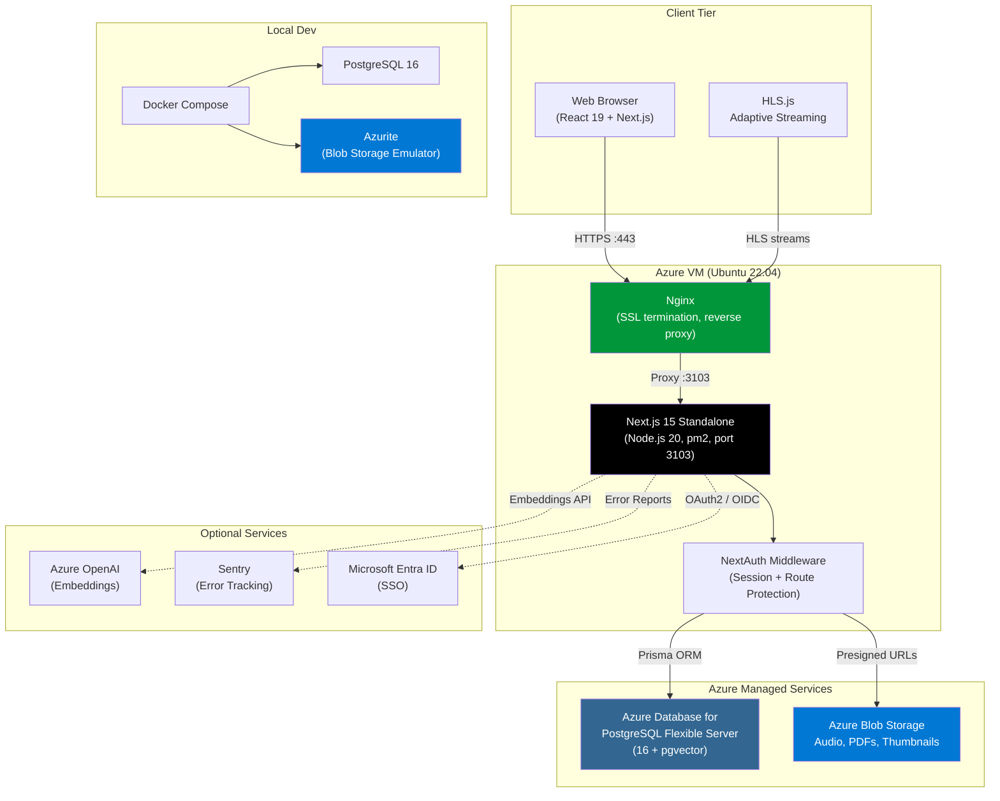

# The Audit Brief

Internal enterprise audio platform for managing, distributing, and tracking audit brief content across an organization.

## Table of Contents

- [Tech Stack](#tech-stack)
- [Architecture](#architecture)
- [Prerequisites](#prerequisites)
- [Local Development Setup](#local-development-setup)
- [Environment Variables](#environment-variables)
- [Authentication & SSO](#authentication--sso)
- [User Roles](#user-roles)
- [Testing](#testing)
- [Project Structure](#project-structure)
- [Deployment](#deployment)
- [Content Security Policy](#content-security-policy)
- [Contributing](#contributing)

## Tech Stack

| Layer         | Technology                                | Purpose                                               |
| ------------- | ----------------------------------------- | ----------------------------------------------------- |
| Framework     | Next.js 15 (App Router), TypeScript 5     | Full-stack React framework with SSR/SSG               |
| Styling       | Tailwind CSS 4, shadcn/ui (Radix)         | Utility-first CSS with accessible component library   |
| State         | Zustand                                   | Client-side state (audio player, graph editor)        |
| Forms         | React Hook Form + Zod                     | Form state management and validation                  |
| Charts        | Recharts                                  | Analytics dashboard visualizations                    |
| Graph Editor  | @xyflow/react, Dagre                      | Visual learning path editor with auto-layout          |
| Drag & Drop   | @dnd-kit                                  | Sortable lists (audit brief ordering, linear editor)  |
| PDF Viewer    | react-pdf (pdfjs-dist)                    | In-app attachment/document viewing                    |
| Audio         | HLS.js                                    | Adaptive audio streaming with native fallback         |
| Database      | PostgreSQL 16, Prisma ORM (v6)            | Data persistence, migrations, pgvector search         |
| Auth          | NextAuth v4 (Credentials + Azure AD)      | JWT session strategy, HttpOnly cookies, SSO support   |
| Storage       | Azurite (dev) / Azure Blob Storage (prod) | File uploads (audio, images, PDFs) via Azure Blob API |
| Logging       | Pino                                      | Structured JSON logging with child loggers            |
| Validation    | Zod v4                                    | Request body + form validation (shared schemas)       |
| Security      | CSP, HSTS, CORS, next.config headers      | HTTP security headers, XSS/clickjack prevention       |
| Notifications | Sonner                                    | Toast notifications                                   |
| Icons         | Lucide React                              | Consistent icon set                                   |
| Theming       | next-themes                               | Dark/light mode switching                             |
| Testing       | Vitest, RTL, Playwright, MSW              | Unit, component, E2E tests (706 tests)                |
| Linting       | ESLint 9 (flat config), Prettier          | Code quality and formatting                           |
| Git Hooks     | Husky + lint-staged                       | Pre-commit lint/format enforcement                    |
| Monitoring    | Sentry                                    | Error tracking and performance monitoring             |
| CI/CD         | GitHub Actions                            | Automated lint, test, build, deploy pipelines         |
| Deployment    | Azure VM, Nginx, pm2                      | VM-based production deployment on port 3103           |

## Architecture



For detailed architecture diagrams covering frontend components, backend API routes, database schema (ER diagram), end-to-end product flow, and deployment infrastructure, see [docs/architecture-diagrams.md](docs/architecture-diagrams.md).

## Prerequisites

- **Node.js** >= 20
- **npm** >= 10
- **Docker** and **Docker Compose** (for PostgreSQL and Azurite)

## Local Development Setup

```bash
# 1. Clone the repository
git clone <repo-url> && cd the-audit-brief

# 2. Install dependencies
npm install

# 3. Copy environment file and adjust values
cp .env.example .env

# 4. Start infrastructure (PostgreSQL + Azurite)
docker compose up -d

# 5. Run database migrations
npx prisma migrate dev

# 6. Seed the database (if applicable)
npx prisma db seed

# 7. Start the development server
npm run dev
```

The app will be available at [http://localhost:3000/auditbrief](http://localhost:3000/auditbrief).

> **Note:** The app is configured with `basePath: '/auditbrief'` in `next.config.ts`, so all routes are prefixed with `/auditbrief`. This matches the subpath deployment on the shared Azure VM (e.g., `uat.uno.wcgt.in/auditbrief`).

## Environment Variables

| Variable                       | Description                                             | Default / Required                 |
| ------------------------------ | ------------------------------------------------------- | ---------------------------------- |
| `DATABASE_URL`                 | PostgreSQL connection string                            | (required)                         |
| `NEXTAUTH_SECRET`              | NextAuth JWT encryption secret                          | (required, min 32 chars)           |
| `NEXTAUTH_URL`                 | Canonical app URL (must include `/auditbrief` basePath) | `http://localhost:3000/auditbrief` |
| `PORT`                         | Server listen port                                      | `3000` (prod: `3103`)              |
| `AZURE_BLOB_CONNECTION_STRING` | Azure Blob Storage connection string                    | (required)                         |
| `AZURE_BLOB_CONTAINER`         | Azure Blob container name                               | `the-audit-brief-uploads`          |
| `AZURE_AD_CLIENT_ID`           | Microsoft Entra ID app client ID                        | (optional, for SSO)                |
| `AZURE_AD_CLIENT_SECRET`       | Microsoft Entra ID app client secret                    | (optional, for SSO)                |
| `AZURE_AD_TENANT_ID`           | Microsoft Entra ID tenant ID                            | (optional, for SSO)                |
| `AZURE_OPENAI_ENDPOINT`        | Azure OpenAI service endpoint                           | (optional)                         |
| `AZURE_OPENAI_KEY`             | Azure OpenAI API key                                    | (optional)                         |
| `AZURE_OPENAI_DEPLOYMENT`      | Azure OpenAI deployment name                            | (optional)                         |
| `SENTRY_DSN`                   | Sentry error tracking DSN (server)                      | (optional)                         |
| `NEXT_PUBLIC_SENTRY_DSN`       | Sentry DSN (client bundle)                              | (optional)                         |
| `NEXT_PUBLIC_APP_URL`          | Origin URL for CORS (no basePath)                       | `http://localhost:3000`            |
| `NODE_ENV`                     | Runtime environment                                     | `development`                      |
| `LOG_LEVEL`                    | Pino log level                                          | `debug`                            |

## Authentication & SSO

The app uses **NextAuth v4** with two authentication providers:

- **Credentials** — email/password login with bcrypt verification
- **Azure AD** — Microsoft Entra ID SSO via OAuth2/OIDC

### How SSO Works

1. User clicks **"Sign in with Microsoft"** on the login page.
2. NextAuth redirects to Microsoft Entra ID for authentication.
3. After successful login, Entra ID redirects back to `/api/auth/callback/azure-ad`.
4. The `signIn` callback handles account linking:
   - If a user with that email already exists in the database, the Azure AD account is **linked** to the existing user record.
   - The `authProvider` field is set to `"entra_id"` (SSO-only) or `"both"` (if they also have a password).
   - If no existing user is found, a new user record is created automatically.
5. The `jwt` callback injects `userId` and `role` from the database into the session token.
6. The middleware enforces route-level auth and admin role checks on every request.

### Azure AD Setup

To enable SSO, register an application in Microsoft Entra ID:

1. Go to **Azure Portal > Entra ID > App Registrations > New Registration**.
2. Set the **Redirect URI**:
   - **Platform:** Select **"Web"** (NOT "Single-page application")
   - **URL:** `https://your-domain.com/auditbrief/api/auth/callback/azure-ad` (use `http://localhost:3000/auditbrief/api/auth/callback/azure-ad` for local dev)
3. Under **Certificates & Secrets**, create a new client secret.

> **Warning:** This is a server-rendered application using a confidential OAuth client.
> The Entra ID app registration platform MUST be "Web", not "SPA". 4. Set the following environment variables:

```bash
AZURE_AD_CLIENT_ID=<Application (client) ID>
AZURE_AD_CLIENT_SECRET=<Client secret value>
AZURE_AD_TENANT_ID=<Directory (tenant) ID>
```

To restrict which users can sign in, go to **Enterprise Applications > your app > Properties** and set **"Assignment required?"** to **Yes**, then assign specific users or groups.

## User Roles

Roles are managed locally in the database (not pulled from Azure AD). Each user has a `role` column that defaults to `"public"`.

| Role         | Access Level                                                     |
| ------------ | ---------------------------------------------------------------- |
| `public`     | Standard user — view content, bookmark, track listening progress |
| `admin`      | Access `/admin` routes — upload, edit, and manage audit briefs   |
| `superadmin` | Full admin access plus user role management                      |

The middleware redirects non-admin users to `/unauthorized` when they attempt to access `/admin/*` routes. API routes use `requireRole()` to enforce role checks.

### Assigning Roles

When a user first signs in (via SSO or credentials), they receive the default `"public"` role. To grant elevated access, update their role directly in the database:

```sql
UPDATE users SET role = 'admin' WHERE email = 'user@yourorg.com';
```

Alternatively, a `superadmin` can change user roles from the admin UI at `/admin/users`.

## Testing

```bash
# Run all unit and integration tests
npm test

# Run tests in watch mode
npm run test:watch

# Run tests with coverage report
npm run test:coverage

# Run end-to-end tests
npm run test:e2e

# Run e2e tests with interactive UI
npm run test:e2e:ui
```

A `.env.test` file is provided for CI test environments.

## Project Structure

```
the-audit-brief/
├── app/
│   ├── (admin)/          # Admin dashboard routes
│   ├── (auth)/           # Login and authentication pages
│   ├── (public)/         # Public-facing routes
│   └── api/              # API route handlers
│       ├── admin/        # Admin management endpoints
│       ├── auth/         # Authentication endpoints
│       ├── bookmarks/    # Bookmark endpoints
│       ├── health/       # Health check
│       ├── learning-graphs/
│       ├── audit-briefs/ # Audit Brief CRUD
│       ├── progress/     # Listening progress
│       ├── search/       # Search endpoints
│       ├── upload/       # File upload
│       └── users/        # User management
├── components/           # React UI components
├── hooks/                # Custom React hooks
├── lib/                  # Shared utilities and services
│   ├── api/              # API helpers (errors, pagination, rate limiting, CORS)
│   ├── auth/             # JWT and authentication logic
│   ├── schemas/          # Zod validation schemas
│   └── ...               # DB client, logger, storage, etc.
├── stores/               # Zustand state stores
├── prisma/               # Prisma schema and migrations
├── __tests__/            # Test suites
│   ├── unit/             # Unit tests
│   ├── integration/      # Integration tests
│   └── e2e/              # Playwright end-to-end tests
├── Dockerfile            # Production container image
├── docker-compose.yml    # Local development infrastructure
└── middleware.ts          # Next.js edge middleware (auth)
```

## Deployment

**Target platform:** Azure VM (Ubuntu 22.04 LTS) with Nginx reverse proxy and pm2 process manager.

The application runs as a standalone Next.js server on **port 3103**, managed by pm2 for automatic restarts and clustering. Nginx handles SSL termination and proxies traffic from ports 80/443 to the app.

### Subpath Deployment

The app is configured with `basePath: '/auditbrief'` so it can be served alongside other apps on a shared VM under `uat.uno.wcgt.in/auditbrief`. Nginx routes `/auditbrief/*` to port 3103.

Key env vars for the VM `.env`:

```bash
NEXTAUTH_URL=https://uat.uno.wcgt.in/auditbrief    # Must include basePath
NEXT_PUBLIC_APP_URL=https://uat.uno.wcgt.in          # Origin only, no basePath (used for CORS)
```

The Azure AD redirect URI in Entra ID must also include the basePath:
`https://uat.uno.wcgt.in/auditbrief/api/auth/callback/azure-ad`

**Infrastructure:**

- **Compute:** Azure VM (Standard_B2s or larger)
- **Database:** Azure Database for PostgreSQL Flexible Server (with pgvector)
- **Storage:** Azure Blob Storage
- **Process Manager:** pm2
- **Reverse Proxy:** Nginx with Let's Encrypt SSL

```bash
# On the Azure VM:
cp .env.example .env   # Single .env file — fill in production values
npm install && npm run build
npx prisma migrate deploy   # Apply pending migrations (not 'migrate dev')
pm2 start ecosystem.config.js
```

For the complete step-by-step deployment guide, see [docs/deployment-guide.md](docs/deployment-guide.md).

### Required Nginx Configuration

The app generates its own per-request, nonce-based `Content-Security-Policy` header in middleware (see [Content Security Policy](#content-security-policy) below for why). For the nonce mechanism to work end-to-end, **nginx must not add its own `Content-Security-Policy` header for the `/auditbrief` location**, otherwise the browser intersects the two policies and drops the nonce.

Add `proxy_hide_header Content-Security-Policy;` to **both** `/auditbrief` location blocks. The full diff against the current production config:

```nginx
# location = /auditbrief  (exact-match block)
location = /auditbrief {
    proxy_pass http://cs_audit_upstream;
    proxy_http_version 1.1;

    proxy_set_header Upgrade $http_upgrade;
    proxy_set_header Connection "upgrade";

    proxy_set_header Host $host;
    proxy_set_header X-Real-IP $remote_addr;
    proxy_set_header X-Forwarded-For $proxy_add_x_forwarded_for;
    proxy_set_header X-Forwarded-Proto $scheme;

    # Let the upstream Next.js app set its own per-request CSP with a nonce.
    # The server-level CSP applied above is strict but lacks a nonce, which
    # would block the framework's inline RSC/hydration scripts.
    proxy_hide_header Content-Security-Policy;
}

# location ^~ /auditbrief/  (prefix-match block)
location ^~ /auditbrief/ {
    proxy_pass http://cs_audit_upstream;
    proxy_http_version 1.1;

    proxy_set_header Upgrade $http_upgrade;
    proxy_set_header Connection "upgrade";

    proxy_set_header Host $host;
    proxy_set_header X-Real-IP $remote_addr;
    proxy_set_header X-Forwarded-For $proxy_add_x_forwarded_for;
    proxy_set_header X-Forwarded-Proto $scheme;

    # See note in `location = /auditbrief` above.
    proxy_hide_header Content-Security-Policy;
}
```

This is **not** a relaxation of the security policy. The app emits a strict policy that:

- forbids inline scripts and styles by default,
- only permits the framework's own RSC/hydration scripts via a per-request, cryptographically-random `nonce`,
- adds `'strict-dynamic'` so chunk loaders work without an explicit allowlist,
- keeps `default-src`, `connect-src`, `img-src`, `font-src`, `worker-src`, `frame-ancestors` at least as strict as nginx's.

The other server-level VAPT headers (HSTS, X-Frame-Options, X-Content-Type-Options, Referrer-Policy, Cache-Control: no-store, etc.) **must remain in place** at the nginx server block — they are unaffected by this change and still apply to the `/auditbrief` location because nginx `add_header` directives at the server block flow through to all locations that don't define their own.

After applying, validate from a workstation:

```bash
# Should show exactly ONE Content-Security-Policy header, with `nonce-…` in script-src + style-src
curl -sI https://uat.uno.wcgt.in/auditbrief/login | grep -i 'content-security-policy'

# Two consecutive requests must return DIFFERENT nonce values
curl -sI https://uat.uno.wcgt.in/auditbrief/login | grep -oE 'nonce-[A-Za-z0-9+/=]+' | head -1
curl -sI https://uat.uno.wcgt.in/auditbrief/login | grep -oE 'nonce-[A-Za-z0-9+/=]+' | head -1
```

If you see two CSP headers in the response, or only the strict no-nonce one, the nginx change has not taken effect (`nginx -t && systemctl reload nginx` after editing).

## Content Security Policy

The app runs under a strict, nonce-based CSP. This section documents the architecture so future contributors do not unknowingly add inline content that the policy will block.

### How it works

1. [middleware.ts](middleware.ts) runs on every HTML/API request. It generates a random nonce per request via [lib/security/csp.ts](lib/security/csp.ts) (`generateNonce()`).
2. The nonce is propagated to the render pipeline via the `x-nonce` request header. Next.js's App Router automatically stamps that nonce onto every framework-emitted `<script>` tag (the inline RSC payload chunks `self.__next_f.push(...)`, the hydration bootstrap, Suspense flush boundaries) and `<link rel="stylesheet">` tag.
3. The same middleware sets the matching `Content-Security-Policy` response header. The policy assembled by `buildContentSecurityPolicy(nonce)` enforces:

   ```text
   default-src 'self';
   script-src 'self' 'nonce-<random>' 'strict-dynamic';
   style-src 'self' 'nonce-<random>';
   style-src-attr 'unsafe-inline';
   img-src 'self' data: blob:;
   media-src 'self' blob:;
   font-src 'self' data:;
   connect-src 'self';
   worker-src 'self' blob:;
   frame-ancestors 'self';
   base-uri 'self';
   form-action 'self';
   object-src 'none';
   upgrade-insecure-requests
   ```

4. [app/layout.tsx](app/layout.tsx) reads the nonce via `headers()` and:
   - emits `<meta name="csp-nonce" content="…">` so `motion/react` picks it up;
   - injects a small bootstrap `<script nonce="…">` at the top of `<body>` that monkey-patches `Document.prototype.createElement` so any `<style>` element a third-party library (sonner, motion, recharts, @dnd-kit) creates at runtime gets the nonce stamped on it before insertion;
   - passes `nonce={nonce}` to `<ThemeProvider>` so `next-themes` applies it to its FOUC-prevention inline script.

### `style-src-attr 'unsafe-inline'` — what it is and why it's safe

CSP nonces apply to `<style>` _tags_ only. Inline `style="…"` _attributes_ (React `style={{}}` props, motion transforms, dnd-kit drag previews, recharts tooltips, resizable-panels) cannot carry a nonce by spec. Allowing them via `style-src-attr 'unsafe-inline'` is **qualitatively very different** from `script-src 'unsafe-inline'`:

- `script-src 'unsafe-inline'` — catastrophic. Any reflected XSS becomes RCE.
- `style-src-attr 'unsafe-inline'` — low risk. An attacker who can already inject HTML can affect appearance but cannot execute code or exfiltrate data beyond very limited CSS-side-channel attacks. OWASP and the CSP3 spec explicitly model this split for exactly this reason.

### Rules for contributors

- **Do not add new inline `<style>{...}</style>` JSX nodes.** Move static CSS (e.g. `@keyframes`) to [app/globals.css](app/globals.css). React `style={{}}` props are fine — they're inline attributes covered by `style-src-attr`.
- **Do not introduce `dangerouslySetInnerHTML` for scripts.** The only such usage is the bootstrap nonce-patcher in `app/layout.tsx`, which is server-rendered with a known-safe nonce string.
- **Do not load scripts/styles/fonts/images from external CDNs.** Use the local package or vendor the asset under `public/` / `node_modules` (Next.js will bundle it). The PDF.js worker in [components/audio-player/bulletin-viewer.tsx](components/audio-player/bulletin-viewer.tsx) is a reference example: `new URL('pdfjs-dist/build/pdf.worker.min.mjs', import.meta.url).toString()`.
- **Do not call `eval`, `new Function`, or string-form `setTimeout`/`setInterval`.** `script-src` does not include `'unsafe-eval'`.
- **Do not hard-code Azure Blob, Sentry ingest, or other external hostnames into client code.** `connect-src 'self'` blocks them; proxy through `/api/...` instead (the `/api/media` proxy is the reference example).

### Adding a new third-party UI library

If a new library injects styles or scripts at runtime, the bootstrap nonce-patcher in `app/layout.tsx` will catch any `<style>` it creates via `document.createElement('style')` (which is the common pattern). Verify by running `npm run build && node .next/standalone/server.js`, opening the app in Chrome with DevTools Console, and exercising the library's UI. Any `Refused to apply inline style` / `Refused to execute inline script` message is a regression.

If a library uses a different injection mechanism (e.g. `innerHTML`, `insertAdjacentHTML`, or a dedicated CSSOM API like `CSSStyleSheet.replaceSync`), and it does not accept a `nonce` prop, prefer:

1. importing the library's static CSS file in `app/layout.tsx` (`import 'pkg/dist/styles.css'`) so Next.js bundles it into a same-origin stylesheet — no nonce needed; or
2. replacing the library with a nonce-aware alternative.

## Contributing

### Branch Naming

```
feat/short-description
fix/short-description
chore/short-description
```

### Commit Messages

Follow [Conventional Commits](https://www.conventionalcommits.org/):

```
feat: add audit brief search endpoint
fix: correct token expiry calculation
chore: update dependencies
```

### Pull Request Process

1. Create a feature branch from `main`.
2. Make changes and ensure all tests pass (`npm test`).
3. Run linting and formatting checks (`npm run lint && npm run format:check`).
4. Run type checking (`npm run typecheck`).
5. Open a pull request with a clear description of changes.
6. Obtain at least one approval before merging.
