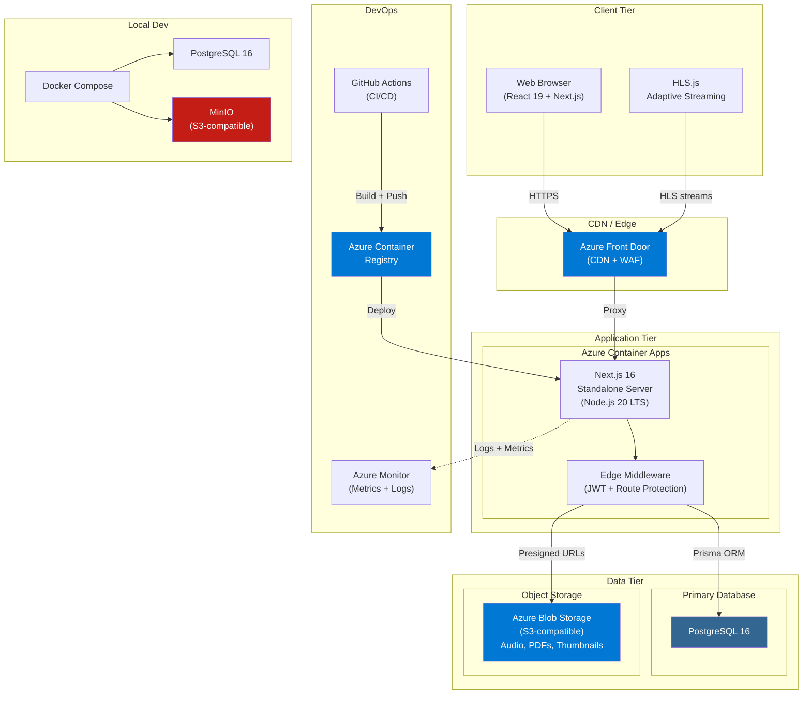

# Podcast Hub v2

Internal enterprise audio podcast platform for managing, distributing, and tracking podcast content across an organization.

## Table of Contents

- [Tech Stack](#tech-stack)
- [Architecture](#architecture)
- [Prerequisites](#prerequisites)
- [Local Development Setup](#local-development-setup)
- [Environment Variables](#environment-variables)
- [Testing](#testing)
- [Project Structure](#project-structure)
- [Deployment](#deployment)
- [Contributing](#contributing)

## Tech Stack

| Layer         | Technology                              | Purpose                                             |
| ------------- | --------------------------------------- | --------------------------------------------------- |
| Framework     | Next.js 16 (App Router), TypeScript 5   | Full-stack React framework with SSR/SSG             |
| Styling       | Tailwind CSS 4, shadcn/ui (Radix)       | Utility-first CSS with accessible component library |
| State         | Zustand                                 | Client-side state (audio player, graph editor)      |
| Forms         | React Hook Form + Zod                   | Form state management and validation                |
| Charts        | Recharts                                | Analytics dashboard visualizations                  |
| Graph Editor  | @xyflow/react, Dagre                    | Visual learning path editor with auto-layout        |
| Drag & Drop   | @dnd-kit                                | Sortable lists (podcast ordering, linear editor)    |
| PDF Viewer    | react-pdf (pdfjs-dist)                  | In-app attachment/document viewing                  |
| Audio         | HLS.js                                  | Adaptive audio streaming with native fallback       |
| Database      | PostgreSQL 16, Prisma ORM (v7)          | Data persistence, migrations, pgvector search       |
| Auth          | Custom JWT (jose + bcryptjs)            | HttpOnly cookie auth with refresh token rotation    |
| Storage       | MinIO (dev) / Azure Blob Storage (prod) | File uploads (audio, images, PDFs) via S3 API       |
| Logging       | Pino                                    | Structured JSON logging with child loggers          |
| Validation    | Zod v4                                  | Request body + form validation (shared schemas)     |
| Security      | CSP, HSTS, CORS, next.config headers    | HTTP security headers, XSS/clickjack prevention     |
| Notifications | Sonner                                  | Toast notifications                                 |
| Icons         | Lucide React                            | Consistent icon set                                 |
| Theming       | next-themes                             | Dark/light mode switching                           |
| Testing       | Vitest, RTL, Playwright, MSW            | Unit, component, E2E tests (449 tests)              |
| Linting       | ESLint 9 (flat config), Prettier        | Code quality and formatting                         |
| Git Hooks     | Husky + lint-staged                     | Pre-commit lint/format enforcement                  |
| Monitoring    | Sentry                                  | Error tracking and performance monitoring           |
| CI/CD         | GitHub Actions                          | Automated lint, test, build, deploy pipelines       |
| Deployment    | Docker, Azure Container Apps            | Containerized production deployment                 |

## Architecture



For detailed architecture diagrams covering frontend components, backend API routes, database schema (ER diagram), end-to-end product flow, and deployment infrastructure, see [docs/architecture-diagrams.md](docs/architecture-diagrams.md).

## Prerequisites

- **Node.js** >= 20
- **npm** >= 10
- **Docker** and **Docker Compose** (for PostgreSQL and MinIO)

## Local Development Setup

```bash
# 1. Clone the repository
git clone <repo-url> && cd podcasthub

# 2. Install dependencies
npm install

# 3. Copy environment file and adjust values
cp .env.example .env

# 4. Start infrastructure (PostgreSQL + MinIO)
docker compose up -d

# 5. Run database migrations
npx prisma migrate dev

# 6. Seed the database (if applicable)
npx prisma db seed

# 7. Start the development server
npm run dev
```

The app will be available at [http://localhost:3000](http://localhost:3000).

## Environment Variables

| Variable                  | Description                         | Default                  |
| ------------------------- | ----------------------------------- | ------------------------ |
| `DATABASE_URL`            | PostgreSQL connection string        | See `.env.example`       |
| `JWT_ACCESS_SECRET`       | Secret for signing access tokens    | (required, min 32 chars) |
| `JWT_REFRESH_SECRET`      | Secret for signing refresh tokens   | (required, min 32 chars) |
| `JWT_ACCESS_EXPIRY`       | Access token TTL                    | `15m`                    |
| `JWT_REFRESH_EXPIRY`      | Refresh token TTL                   | `7d`                     |
| `BCRYPT_SALT_ROUNDS`      | bcrypt hashing cost factor          | `12`                     |
| `S3_ENDPOINT`             | MinIO / S3-compatible endpoint      | `http://localhost:9000`  |
| `S3_ACCESS_KEY`           | S3 access key                       | `minioadmin`             |
| `S3_SECRET_KEY`           | S3 secret key                       | `minioadmin`             |
| `S3_BUCKET_AUDIO`         | Bucket for audio files              | `audio`                  |
| `S3_BUCKET_THUMBNAILS`    | Bucket for thumbnail images         | `thumbnails`             |
| `S3_BUCKET_BULLETINS`     | Bucket for bulletin PDFs            | `bulletins`              |
| `AZURE_OPENAI_ENDPOINT`   | Azure OpenAI service endpoint       | (optional)               |
| `AZURE_OPENAI_KEY`        | Azure OpenAI API key                | (optional)               |
| `AZURE_OPENAI_DEPLOYMENT` | Azure OpenAI deployment name        | (optional)               |
| `SENTRY_DSN`              | Sentry error tracking DSN (server)  | (optional)               |
| `NEXT_PUBLIC_SENTRY_DSN`  | Sentry DSN (client bundle)          | (optional)               |
| `NEXT_PUBLIC_APP_URL`     | Public application URL              | `http://localhost:3000`  |
| `NODE_ENV`                | Runtime environment                 | `development`            |
| `LOG_LEVEL`               | Pino log level                      | `debug`                  |
| `SLOW_QUERY_THRESHOLD_MS` | Prisma slow query warning threshold | `500`                    |

## Testing

```bash
# Run all unit and integration tests
npm test

# Run tests in watch mode
npm run test:watch

# Run tests with coverage report
npm run test:coverage

# Run end-to-end tests
npm run test:e2e

# Run e2e tests with interactive UI
npm run test:e2e:ui
```

A `.env.test` file is provided for CI test environments.

## Project Structure

```
podcasthub/
├── app/
│   ├── (admin)/          # Admin dashboard routes
│   ├── (auth)/           # Login and authentication pages
│   ├── (public)/         # Public-facing routes
│   └── api/              # API route handlers
│       ├── admin/        # Admin management endpoints
│       ├── auth/         # Authentication endpoints
│       ├── bookmarks/    # Bookmark endpoints
│       ├── health/       # Health check
│       ├── learning-graphs/
│       ├── podcasts/     # Podcast CRUD
│       ├── progress/     # Listening progress
│       ├── search/       # Search endpoints
│       ├── upload/       # File upload
│       └── users/        # User management
├── components/           # React UI components
├── hooks/                # Custom React hooks
├── lib/                  # Shared utilities and services
│   ├── api/              # API helpers (errors, pagination, rate limiting, CORS)
│   ├── auth/             # JWT and authentication logic
│   ├── schemas/          # Zod validation schemas
│   └── ...               # DB client, logger, storage, etc.
├── stores/               # Zustand state stores
├── prisma/               # Prisma schema and migrations
├── __tests__/            # Test suites
│   ├── unit/             # Unit tests
│   ├── integration/      # Integration tests
│   └── e2e/              # Playwright end-to-end tests
├── Dockerfile            # Production container image
├── docker-compose.yml    # Local development infrastructure
└── middleware.ts          # Next.js edge middleware (auth)
```

## Deployment

The application is containerized using a multi-stage Dockerfile that produces a standalone Next.js build.

**Target platform:** Azure Container Apps

```bash
# Build the Docker image
docker build -t podcast-hub-v2 .

# Run the container
docker run -p 3000:3000 --env-file .env podcast-hub-v2
```

For production deployments, push the image to Azure Container Registry and deploy via Azure Container Apps. Ensure all required environment variables are configured in the deployment environment.

## Contributing

### Branch Naming

```
feat/short-description
fix/short-description
chore/short-description
```

### Commit Messages

Follow [Conventional Commits](https://www.conventionalcommits.org/):

```
feat: add podcast search endpoint
fix: correct token expiry calculation
chore: update dependencies
```

### Pull Request Process

1. Create a feature branch from `main`.
2. Make changes and ensure all tests pass (`npm test`).
3. Run linting and formatting checks (`npm run lint && npm run format:check`).
4. Run type checking (`npm run typecheck`).
5. Open a pull request with a clear description of changes.
6. Obtain at least one approval before merging.
