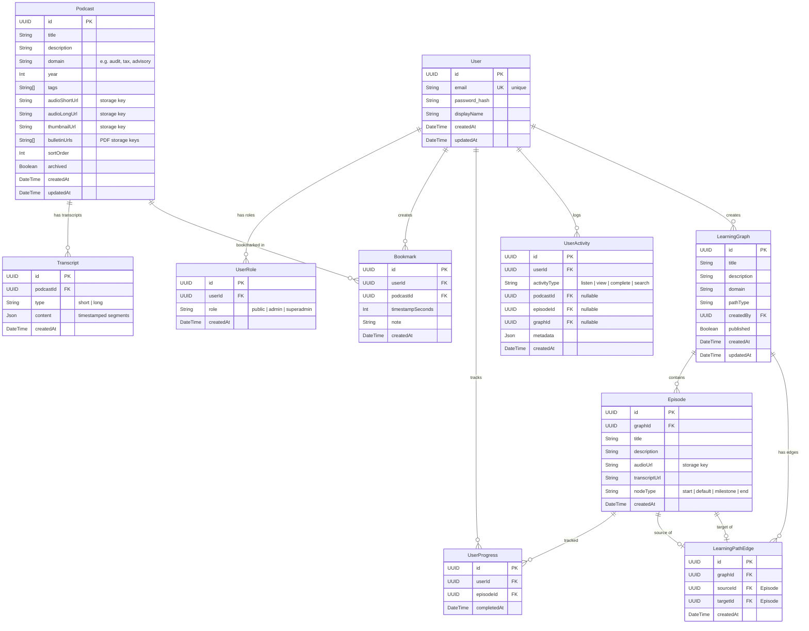
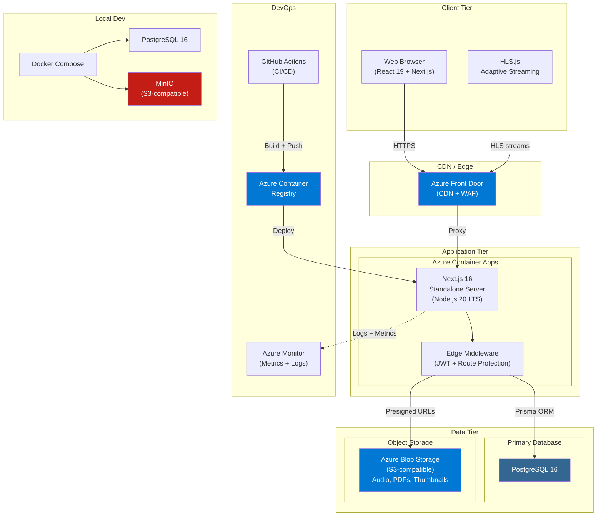
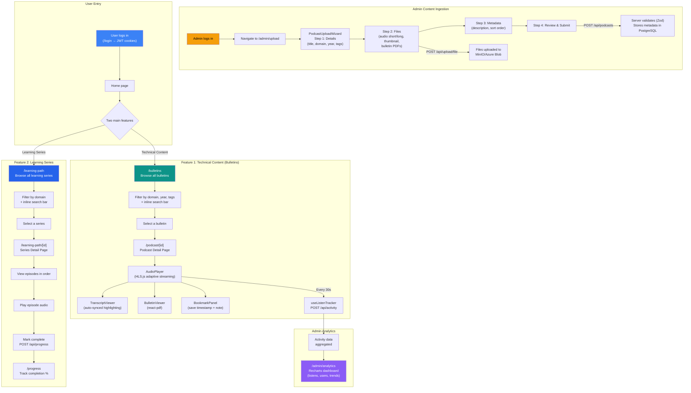
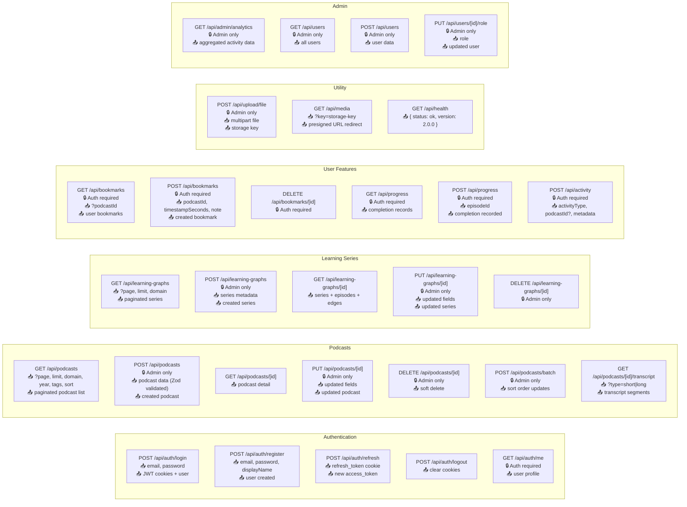
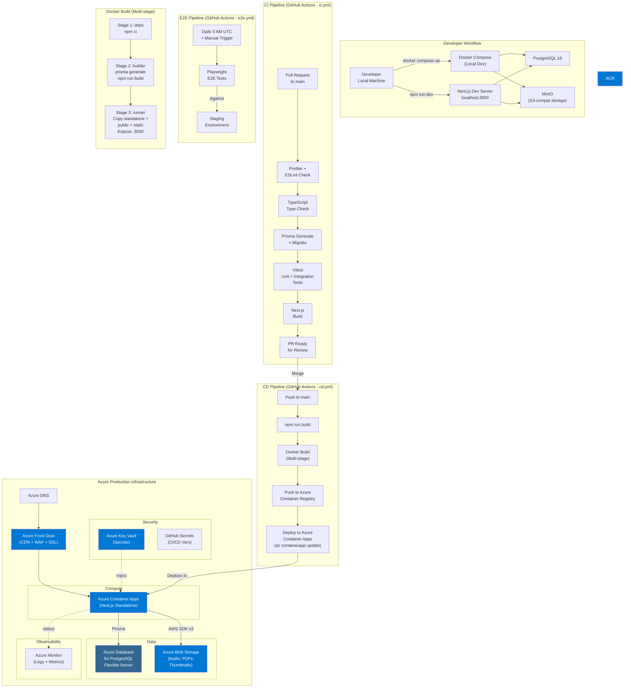

# The Audit Brief — Architecture Diagrams

## 1. Frontend Architecture

```mermaid
graph TB
    subgraph "Next.js App Router"
        direction TB
        RootLayout["Root Layout<br/>(ThemeProvider, AudioProvider, Sidebar)"]

        subgraph "Route Group: (auth)"
            Login["/login<br/>LoginForm"]
            Register["/register<br/>RegisterForm"]
            Unauthorized["/unauthorized<br/>403 Page"]
        end

        subgraph "Route Group: (public)"
            Home["/ Home<br/>Server Component"]
            Bulletins["/bulletins<br/>PodcastGrid + Filters"]
            PodcastDetail["/podcast/[id]<br/>AudioPlayer + Transcript"]
            LearningPaths["/learning-path<br/>Series List"]
            LearningPathDetail["/learning-path/[id]<br/>Series Detail"]
            Progress["/progress<br/>Dashboard"]
            Profile["/profile<br/>Settings"]
        end

        subgraph "Route Group: (admin)"
            AdminDash["/admin<br/>Dashboard"]
            Upload["/admin/upload<br/>PodcastUploadWizard"]
            EditPodcast["/admin/edit/[id]<br/>EditPodcastClient"]
            LearningGraphsMgmt["/admin/learning-graphs<br/>Series Management"]
            LearningGraphsNew["/admin/learning-graphs/new<br/>Create Series"]
            Analytics["/admin/analytics<br/>Recharts Dashboard"]
            UserMgmt["/admin/users<br/>User Table"]
        end
    end

    subgraph "Shared Components"
        direction LR
        ShadcnUI["shadcn/ui<br/>(Button, Card, Dialog,<br/>Table, Input, etc.)"]
        AudioStack["Audio Player Stack<br/>(GlobalAudioPlayer,<br/>CompactPlayer,<br/>TranscriptViewer,<br/>BulletinViewer,<br/>BookmarkPanel)"]
        LayoutComps["Layout<br/>(UnifiedSidebar,<br/>MobileTopBar,<br/>MobileBottomPlayer,<br/>CommandPalette)"]
    end

    subgraph "State Management (Zustand)"
        PlayerStore["PlayerStore<br/>currentPodcast, isPlaying,<br/>currentTime, volume,<br/>playbackRate, audioType"]
    end

    subgraph "Custom Hooks"
        useHls["useHlsPlayer()<br/>HLS.js + native audio"]
        useUpload["useFileUpload()<br/>XHR + progress"]
        useTracker["useListenTracker()<br/>30s activity log"]
        useSync["useTranscriptSync()<br/>segment highlighting"]
        useUnsaved["useUnsavedChangesWarning()"]
        useWizard["useWizardState()"]
    end

    RootLayout --> Login & Register & Unauthorized
    RootLayout --> Home & Bulletins & PodcastDetail & LearningPaths & LearningPathDetail & Progress & Profile
    RootLayout --> AdminDash & Upload & EditPodcast & LearningGraphsMgmt & LearningGraphsNew & Analytics & UserMgmt

    PodcastDetail --> AudioStack
    PodcastDetail --> PlayerStore
    AudioStack --> useHls
    AudioStack --> useSync
    AudioStack --> useTracker
    Upload --> useUpload & useWizard
    LayoutComps --> PlayerStore

    style RootLayout fill:#1e293b,color:#fff
    style PlayerStore fill:#7c3aed,color:#fff
```

---

## 2. Backend Architecture

```mermaid
graph TB
    subgraph "Client Request"
        Browser["Browser / Client"]
    end

    subgraph "Edge Middleware Layer"
        MW["middleware.ts<br/>(JWT verify via jose)"]
        MW -->|"Set Headers"| Headers["x-user-id<br/>x-user-email<br/>x-user-role"]
        MW -->|"Auto-refresh"| TokenRefresh["Silent Token<br/>Refresh"]
    end

    subgraph "API Routes Layer"
        direction TB

        subgraph "Auth APIs"
            AuthLogin["POST /api/auth/login"]
            AuthRegister["POST /api/auth/register"]
            AuthRefresh["POST /api/auth/refresh"]
            AuthLogout["POST /api/auth/logout"]
            AuthMe["GET /api/auth/me"]
        end

        subgraph "Content APIs"
            PodcastsList["GET /api/podcasts"]
            PodcastCreate["POST /api/podcasts"]
            PodcastGet["GET /api/podcasts/[id]"]
            PodcastUpdate["PUT /api/podcasts/[id]"]
            PodcastDelete["DELETE /api/podcasts/[id]"]
            PodcastBatch["POST /api/podcasts/batch"]
            Transcript["GET /api/podcasts/[id]/transcript"]
        end

        subgraph "Learning Series APIs"
            GraphList["GET /api/learning-graphs"]
            GraphCreate["POST /api/learning-graphs"]
            GraphGet["GET /api/learning-graphs/[id]"]
            GraphUpdate["PUT /api/learning-graphs/[id]"]
            GraphDelete["DELETE /api/learning-graphs/[id]"]
        end

        subgraph "User Feature APIs"
            BookmarksCRUD["GET/POST/DELETE<br/>/api/bookmarks"]
            ProgressCRUD["GET/POST<br/>/api/progress"]
            ActivityLog["POST /api/activity"]
        end

        subgraph "Utility APIs"
            UploadAPI["POST /api/upload/file"]
            MediaProxy["GET /api/media"]
            HealthAPI["GET /api/health"]
        end

        subgraph "Admin APIs"
            AdminAnalytics["GET /api/admin/analytics"]
            UsersList["GET /api/users"]
            UsersCreate["POST /api/users"]
            UserRole["PUT /api/users/[id]/role"]
        end
    end

    subgraph "Service Layer (lib/)"
        direction TB
        AuthService["lib/auth/<br/>jwt.ts, password.ts,<br/>cookies.ts,<br/>api-helpers.ts"]
        APIUtils["lib/api/<br/>errors.ts, pagination.ts,<br/>rate-limit.ts, cors.ts"]
        Schemas["lib/schemas/<br/>Zod validation<br/>(user, podcast, learning-graph,<br/>bookmark, common)"]
        Storage["lib/storage.ts<br/>S3 presigned URLs<br/>(AWS SDK v3)"]
        Logger["lib/logger.ts<br/>Pino structured logging"]
        Prisma["lib/db.ts<br/>Prisma client singleton"]
    end

    subgraph "Data Layer"
        PG["PostgreSQL 16"]
        S3["MinIO / Azure Blob<br/>(S3-compatible)"]
    end

    Browser --> MW
    MW --> Headers
    Headers -->|"Route to"| AuthLogin & PodcastsList & GraphList & BookmarksCRUD & AdminAnalytics

    AuthLogin --> AuthService
    PodcastCreate --> Schemas --> APIUtils
    UploadAPI --> Storage

    AuthService --> Prisma
    APIUtils --> Prisma
    Prisma --> PG
    Storage --> S3
    Logger -.->|"All layers"| AuthService & APIUtils

    style MW fill:#f59e0b,color:#000
    style PG fill:#336791,color:#fff
    style S3 fill:#c41d15,color:#fff
```

---

## 3. Database Schema (Entity Relationship)

---

## 4. High-Level System Architecture

---

## 5. End-to-End Product Flow

---

## 6. API Endpoint Map

---

## 7. Deployment & Infrastructure

