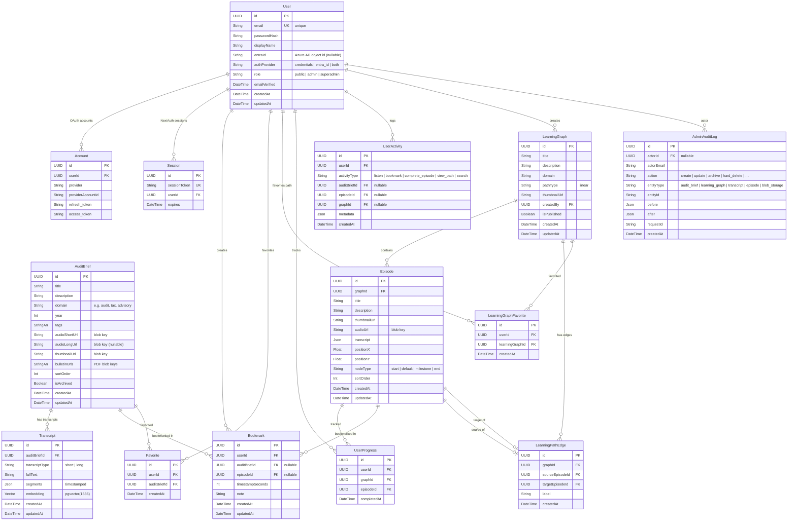
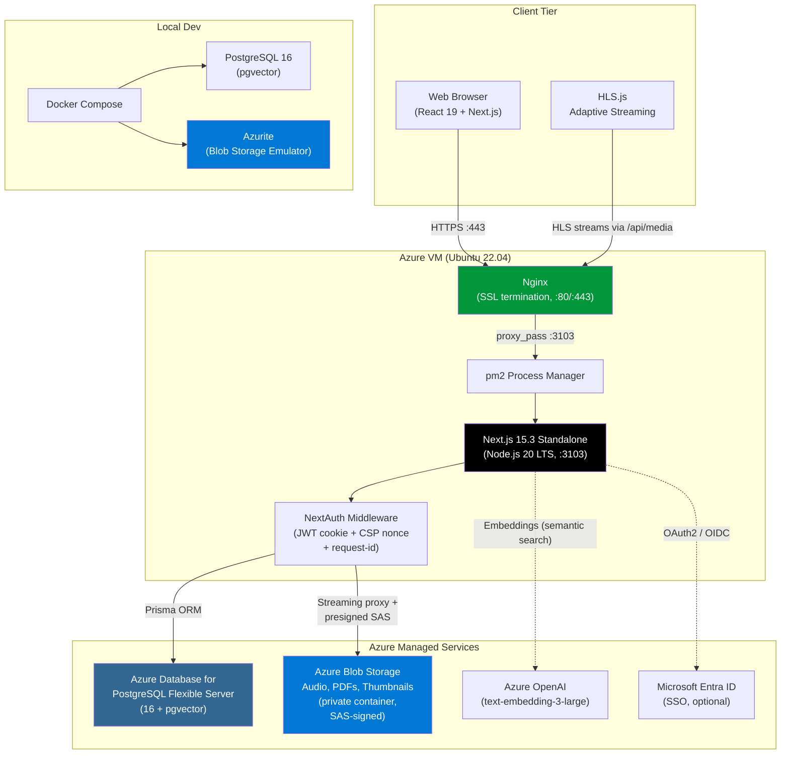
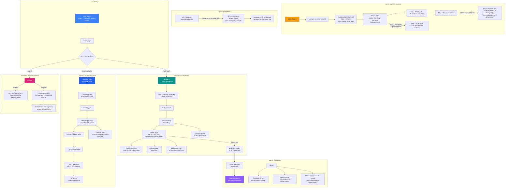
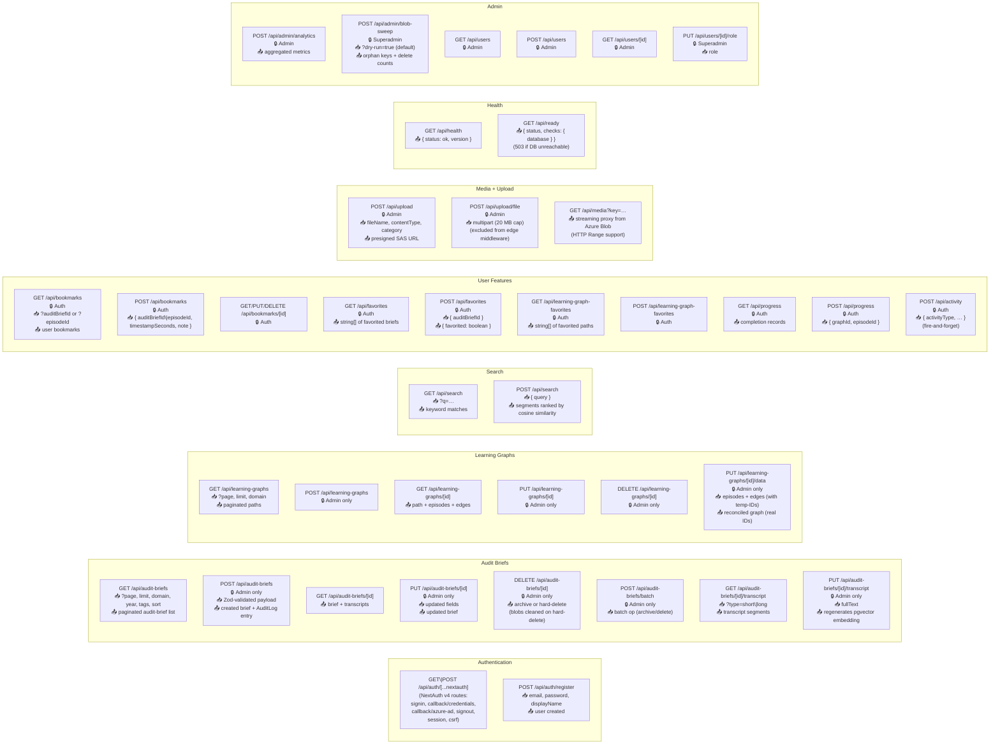
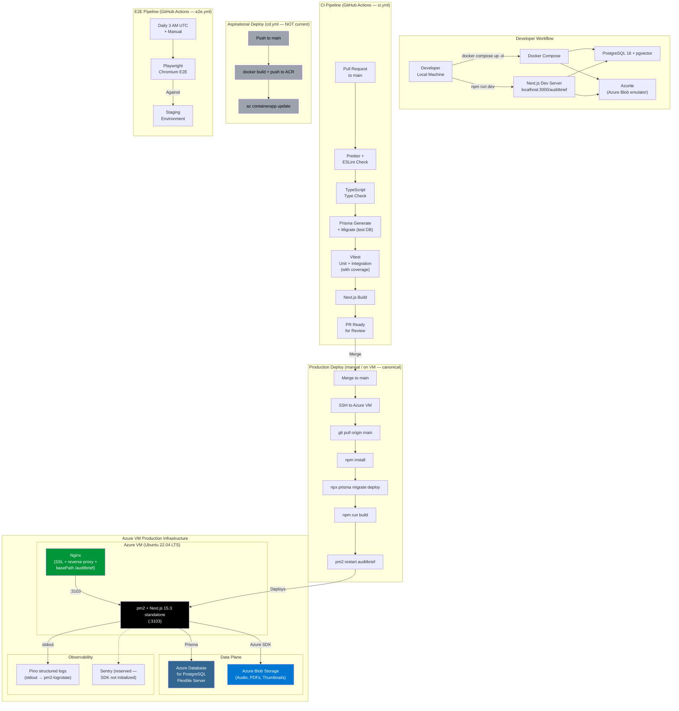

# The Audit Brief — Architecture Diagrams

> The canonical entities in this project are **AuditBrief** (a piece of audio content with transcript + bulletins), **LearningGraph** (a sequence of episodes), and **Episode** (a node in a learning graph). Earlier iterations called the content "Podcast" — that name is gone from the code and from these diagrams. C4-style source diagrams live in [architecture/](architecture/).

## 1. Frontend Architecture

```mermaid
graph TB
    subgraph "Next.js App Router"
        direction TB
        RootLayout["Root Layout<br/>(SessionProvider, ThemeProvider,<br/>NonceProvider, AudioProvider)"]

        subgraph "Route Group: (auth)"
            Login["/login<br/>LoginForm + SSO Button"]
            Register["/register<br/>RegisterForm"]
            Unauthorized["/unauthorized<br/>403 Page"]
        end

        subgraph "Route Group: (public)"
            Home["/<br/>Home Card Grid"]
            Bulletins["/bulletins<br/>AuditBrief Grid + Filters"]
            AuditBriefDetail["/audit-brief/[id]<br/>AudioPlayer + Transcript + Bulletins"]
            Search["/search<br/>Keyword + Semantic Search"]
            LearningPaths["/learning-path<br/>Path List"]
            LearningPathDetail["/learning-path/[id]<br/>Linear Episode Viewer"]
            Progress["/progress<br/>User Progress Dashboard"]
        end

        subgraph "Route Group: (admin)"
            AdminDash["/admin<br/>AuditBrief Management"]
            Upload["/admin/upload<br/>AuditBriefUploadWizard"]
            EditBrief["/admin/edit/[id]<br/>EditAuditBriefClient"]
            EditTranscript["/admin/edit/[id]/transcript<br/>TranscriptEditor"]
            LearningGraphsMgmt["/admin/learning-graphs<br/>Path Management Table"]
            LearningGraphsNew["/admin/learning-graphs/new"]
            LearningGraphsEdit["/admin/learning-graphs/[id]<br/>Linear Editor"]
            Analytics["/admin/analytics<br/>Recharts Dashboard"]
            UserMgmt["/admin/users<br/>User Table + Role Assignment"]
            AuditLog["/admin/audit-log<br/>AdminAuditLog Viewer"]
        end
    end

    subgraph "Shared Components"
        direction LR
        ShadcnUI["shadcn/ui<br/>(Button, Card, Dialog,<br/>Table, Input, etc.)"]
        AudioStack["Audio Player Stack<br/>(GlobalAudioPlayer,<br/>CompactPlayer,<br/>TranscriptViewer,<br/>BulletinViewer,<br/>BookmarkPanel)"]
        LayoutComps["Layout<br/>(UnifiedSidebar,<br/>MobileTopBar,<br/>MobileBottomPlayer,<br/>CommandPalette)"]
    end

    subgraph "State Management (Zustand)"
        PlayerStore["PlayerStore<br/>currentAuditBrief, isPlaying,<br/>currentTime, volume,<br/>playbackRate, audioType"]
        GraphEditorStore["GraphEditorStore<br/>nodes, edges, selection,<br/>dirty flag, auto-save"]
    end

    subgraph "Custom Hooks"
        useHls["useHlsPlayer()<br/>HLS.js + native audio"]
        useUpload["useFileUpload()<br/>Presigned SAS + XHR progress"]
        useTracker["useListenTracker()<br/>30s activity log"]
        useSync["useTranscriptSync()<br/>segment highlighting"]
        useUnsaved["useUnsavedChangesWarning()"]
        useWizard["useWizardState()"]
        useFavorites["useFavorites() +<br/>useLearningGraphFavorites()"]
    end

    RootLayout --> Login & Register & Unauthorized
    RootLayout --> Home & Bulletins & AuditBriefDetail & Search & LearningPaths & LearningPathDetail & Progress
    RootLayout --> AdminDash & Upload & EditBrief & EditTranscript & LearningGraphsMgmt & LearningGraphsNew & LearningGraphsEdit & Analytics & UserMgmt & AuditLog

    AuditBriefDetail --> AudioStack
    AuditBriefDetail --> PlayerStore
    AudioStack --> useHls
    AudioStack --> useSync
    AudioStack --> useTracker
    Upload --> useUpload & useWizard
    LearningGraphsEdit --> GraphEditorStore
    LayoutComps --> PlayerStore

    style RootLayout fill:#1e293b,color:#fff
    style PlayerStore fill:#7c3aed,color:#fff
    style GraphEditorStore fill:#7c3aed,color:#fff
```

---

## 2. Backend Architecture

```mermaid
graph TB
    subgraph "Client Request"
        Browser["Browser / Client"]
    end

    subgraph "Edge Middleware Layer"
        MW["middleware.ts<br/>(JWT verify via getToken,<br/>CSP nonce generation,<br/>request-id propagation)"]
        MW -->|"Set Headers"| Headers["x-request-id<br/>x-nonce<br/>x-user-id<br/>x-user-email<br/>x-user-role"]
        MW -->|"Auth check"| SessionCheck["NextAuth Session<br/>(encrypted JWT cookie)"]
    end

    subgraph "API Routes Layer"
        direction TB

        subgraph "Auth APIs"
            NextAuthAPI["GET/POST /api/auth/[...nextauth]"]
            AuthRegister["POST /api/auth/register"]
        end

        subgraph "Content APIs"
            AuditBriefsList["GET /api/audit-briefs"]
            AuditBriefCreate["POST /api/audit-briefs"]
            AuditBriefGet["GET /api/audit-briefs/[id]"]
            AuditBriefUpdate["PUT /api/audit-briefs/[id]"]
            AuditBriefDelete["DELETE /api/audit-briefs/[id]"]
            AuditBriefBatch["POST /api/audit-briefs/batch"]
            TranscriptGet["GET /api/audit-briefs/[id]/transcript"]
            TranscriptUpdate["PUT /api/audit-briefs/[id]/transcript"]
        end

        subgraph "Learning Graph APIs"
            GraphList["GET /api/learning-graphs"]
            GraphCreate["POST /api/learning-graphs"]
            GraphGet["GET /api/learning-graphs/[id]"]
            GraphUpdate["PUT /api/learning-graphs/[id]"]
            GraphDelete["DELETE /api/learning-graphs/[id]"]
            GraphDataSave["PUT /api/learning-graphs/[id]/data<br/>(bulk episode + edge upsert)"]
        end

        subgraph "Search APIs"
            SearchKeyword["GET /api/search?q=…"]
            SearchSemantic["POST /api/search<br/>(pgvector + Azure OpenAI)"]
        end

        subgraph "User Feature APIs"
            BookmarksCRUD["GET/POST /api/bookmarks +<br/>GET/PUT/DELETE /api/bookmarks/[id]"]
            FavoritesToggle["GET/POST /api/favorites"]
            GraphFavToggle["GET/POST /api/learning-graph-favorites"]
            ProgressCRUD["GET/POST /api/progress +<br/>GET/PUT /api/progress/[id]"]
            ActivityLog["POST /api/activity<br/>(fire-and-forget)"]
        end

        subgraph "Media + Upload APIs"
            UploadPresigned["POST /api/upload<br/>(presigned SAS URL)"]
            UploadMultipart["POST /api/upload/file<br/>(20 MB body cap)"]
            MediaProxy["GET /api/media?key=<br/>(streaming proxy w/ HTTP Range)"]
        end

        subgraph "Health"
            HealthAPI["GET /api/health (liveness)"]
            ReadyAPI["GET /api/ready (DB ping)"]
        end

        subgraph "Admin APIs"
            AdminAnalytics["POST /api/admin/analytics"]
            BlobSweep["POST /api/admin/blob-sweep<br/>(superadmin, dry-run by default)"]
            UsersList["GET /api/users"]
            UsersCreate["POST /api/users"]
            UserGet["GET /api/users/[id]"]
            UserRole["PUT /api/users/[id]/role<br/>(superadmin only)"]
        end
    end

    subgraph "Service Layer (lib/)"
        direction TB
        AuthService["lib/auth/<br/>next-auth-options.ts,<br/>password.ts,<br/>session-helpers.ts,<br/>prisma-adapter.ts,<br/>token-revocation.ts"]
        APIUtils["lib/api/<br/>errors.ts, pagination.ts,<br/>rate-limit.ts, cors.ts,<br/>request-context.ts, request-logging.ts"]
        Schemas["lib/schemas/<br/>Zod validation<br/>(audit-brief, learning-graph,<br/>bookmark, user, common, admin)"]
        Storage["lib/storage.ts + lib/storage-*.ts<br/>(Azure Blob ops, streaming)"]
        Embeddings["lib/embeddings.ts<br/>(Azure OpenAI, retry + backoff)"]
        AdminOps["lib/admin/<br/>audit-log, blob-sweep,<br/>concurrency, revalidate"]
        Security["lib/security/csp.ts<br/>(nonce + policy assembly)"]
        Logger["lib/logger.ts<br/>(Pino structured logging)"]
        Prisma["lib/db.ts +<br/>lib/db-instrumentation.ts<br/>(Prisma + slow-query logging)"]
    end

    subgraph "Data Layer"
        PG["PostgreSQL 16<br/>(pgvector extension)"]
        AzureBlob["Azure Blob Storage<br/>(private container,<br/>SAS-signed access)"]
    end

    Browser --> MW
    MW --> Headers
    Headers -->|"Route to"| NextAuthAPI & AuditBriefsList & GraphList & BookmarksCRUD & AdminAnalytics & MediaProxy

    AuditBriefCreate --> Schemas --> APIUtils
    SearchSemantic --> Embeddings
    UploadPresigned --> Storage
    MediaProxy --> Storage
    AdminAnalytics --> AdminOps

    AuthService --> Prisma
    APIUtils --> Prisma
    AdminOps --> Prisma
    Prisma --> PG
    Storage --> AzureBlob
    Logger -.->|"All layers"| AuthService & APIUtils & AdminOps & Storage

    style MW fill:#f59e0b,color:#000
    style PG fill:#336791,color:#fff
    style AzureBlob fill:#0078d4,color:#fff
```

---

## 3. Database Schema (Entity Relationship)

Source of truth: [`prisma/schema.prisma`](../prisma/schema.prisma). Field lists below are abbreviated; consult the schema for the authoritative shape.

---

## 4. High-Level System Architecture

---

## 5. End-to-End Product Flow

---

## 6. API Endpoint Map

---

## 7. Deployment & Infrastructure

> **Canonical deployment is the Azure VM + Nginx + pm2 path.** The `cd.yml` workflow targets Azure Container Apps but is out of sync with production — see [deployment-guide.md](deployment-guide.md).

