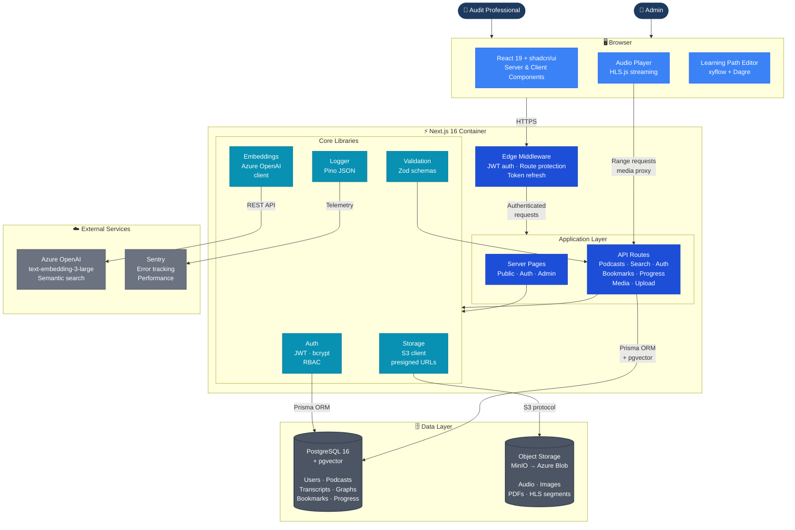
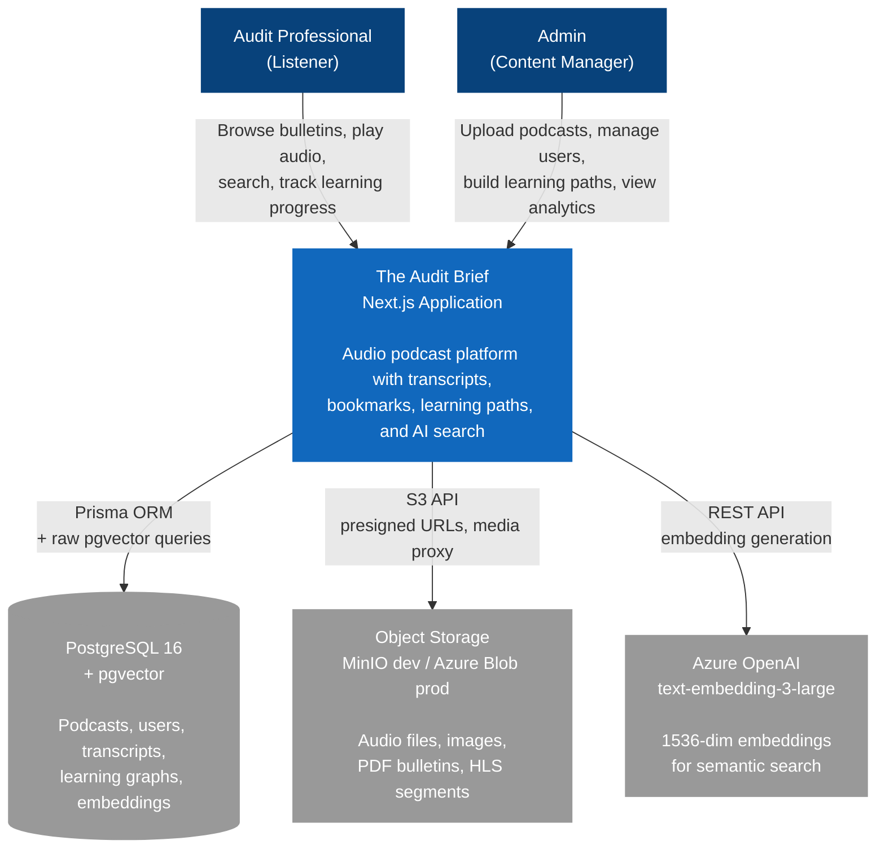
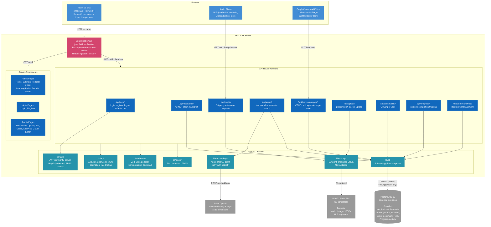
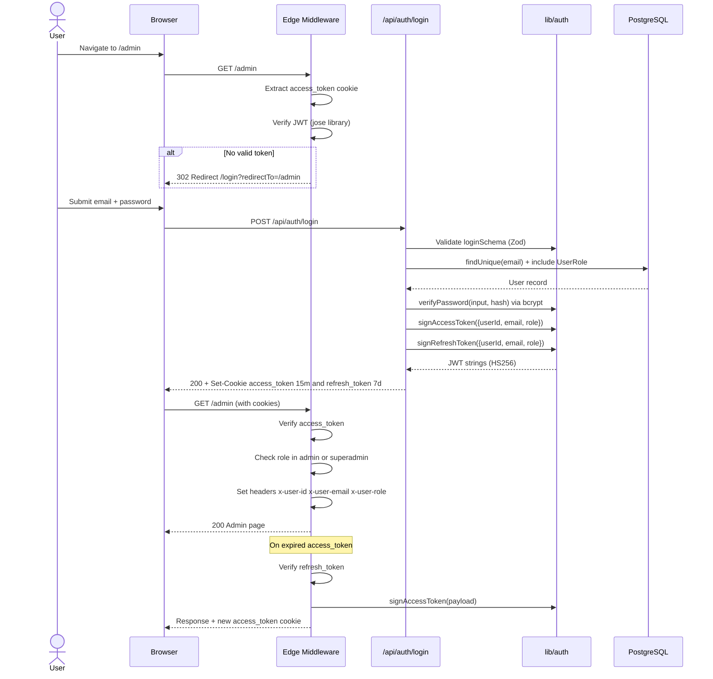
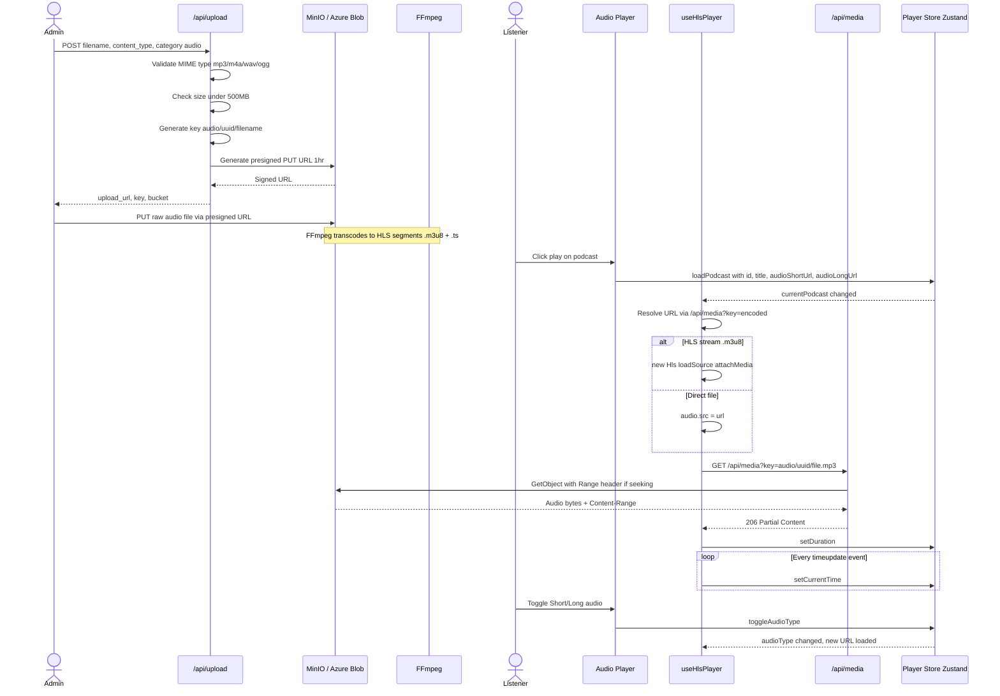
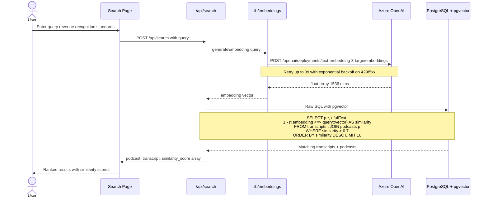
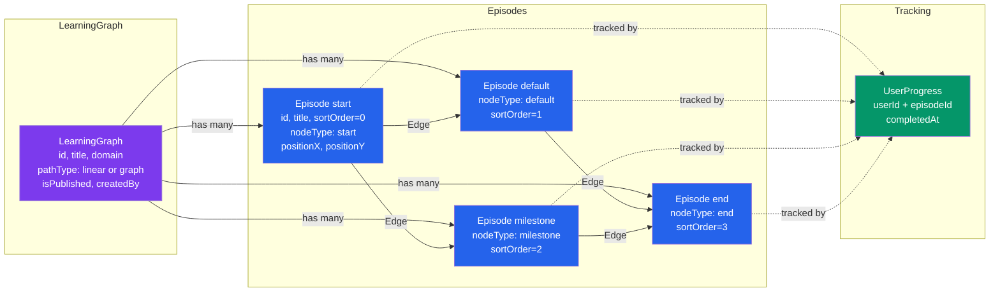
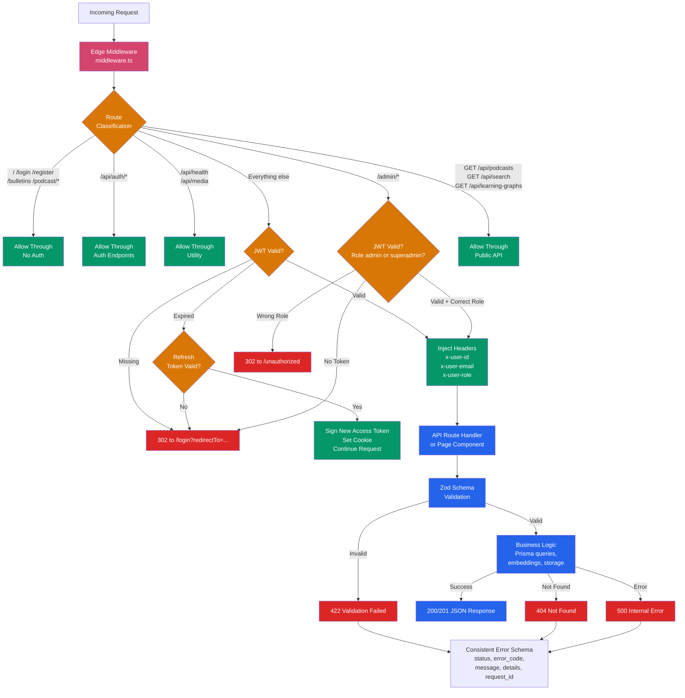

# The Audit Brief — Architecture Diagrams

Each diagram is a separate `.mmd` file that can be opened in any Mermaid renderer (VS Code Mermaid extension, mermaid.live, GitHub, etc.).

| #   | Diagram               | File                                                       | Description                                                |
| --- | --------------------- | ---------------------------------------------------------- | ---------------------------------------------------------- |
| 0   | Architecture Overview | [0-architecture-overview.mmd](0-architecture-overview.mmd) | Simplified view — containers, data flow, external services |
| 1   | System Context        | [1-system-context.mmd](1-system-context.mmd)               | C4 Level 1 — actors and external systems                   |
| 2   | Container Diagram     | [2-container-diagram.mmd](2-container-diagram.mmd)         | C4 Level 2 — browser, server, libraries, infra             |
| 3   | Authentication Flow   | [3-auth-flow.mmd](3-auth-flow.mmd)                         | JWT login, middleware verification, token refresh          |
| 4   | Audio Pipeline        | [4-audio-pipeline.mmd](4-audio-pipeline.mmd)               | Upload, HLS transcoding, streaming playback                |
| 5   | Semantic Search       | [5-semantic-search.mmd](5-semantic-search.mmd)             | Azure OpenAI embeddings + pgvector similarity              |
| 6   | Learning Path Model   | [6-learning-path-model.mmd](6-learning-path-model.mmd)     | DAG structure — graphs, episodes, edges, progress          |
| 7   | Request Lifecycle     | [7-request-lifecycle.mmd](7-request-lifecycle.mmd)         | Full request flow through middleware, auth, handlers       |

---

## Rendered Diagrams

### 0. Architecture Overview

### 1. System Context

### 2. Container Diagram

### 3. Authentication Flow

### 4. Audio Streaming Pipeline

### 5. Semantic Search Flow

### 6. Learning Path Data Model

### 7. Request Lifecycle

